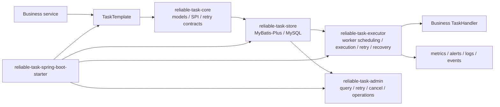

# ReliableTask

ReliableTask is a reliable asynchronous task execution framework for Spring Boot applications.
It persists business tasks in MySQL, executes them with workers, retries recoverable failures,
recovers timed-out executions, and exposes admin APIs for operational visibility.

[English](README.md) | [中文](README.zh-CN.md)

[](https://openjdk.org/projects/jdk/17/)
[](https://spring.io/projects/spring-boot)
[](https://baomidou.com/)
[](https://github.com/naruto863/reliable-task/actions/workflows/ci.yml)
[](LICENSE)

> ReliableTask is currently on preview release `v0.3.0`. APIs, configuration, and database schema may evolve before `v1.0.0`.

## Table of Contents

- [Why ReliableTask](#why-reliabletask)
- [Use Cases and Non-Goals](#use-cases-and-non-goals)
- [Features](#features)
- [Architecture](#architecture)
- [Reliability Semantics](#reliability-semantics)
- [Modules](#modules)
- [Requirements](#requirements)
- [Quick Start](#quick-start)
- [Installation](#installation)
- [Configuration](#configuration)
- [Admin Operational Queries](#admin-operational-queries)
- [Production Checklist](#production-checklist)
- [Security](#security)
- [Testing](#testing)
- [FAQ](#faq)
- [Release](#release)
- [Contributing](#contributing)
- [License](#license)

## Why ReliableTask

ReliableTask is designed for business workflows where a database transaction must create durable follow-up work,
such as sending notifications, issuing coupons, synchronizing data, or triggering compensation tasks.

It is not a general-purpose message queue. The current preview focuses on a database-backed execution model:
write the business record and the task record in one transaction, then let workers claim, execute, retry, and recover tasks.

## Use Cases and Non-Goals

Business applications often start with small asynchronous follow-up actions, then run into reliability problems:

- An order, payment, or shipment transaction commits, but the follow-up coupon, notification, or external sync must not disappear.
- `@Async` or a local thread pool is easy to add, but a process restart, rejected task, or uncaught exception can leave no durable task state to inspect or retry.
- Calling external HTTP, RPC, or MQ systems inside the business transaction extends lock time and lets external instability slow down the core path.
- After-commit callbacks avoid blocking the transaction, but retry policy, timeout recovery, dead-letter handling, and manual operations still need to be built.
- A full message broker may be too much for a small set of internal reliable tasks once transaction handoff, consumer idempotency, dead-letter operations, and tracing are included.
- Scheduled scans over business tables can work, but retry count, next execution time, failure diagnostics, concurrent claiming, and audit history tend to spread across the codebase.

ReliableTask fits best when:

- A Spring Boot application already uses MySQL and can use a database-backed Outbox model for reliable post-transaction work.
- Task records must commit or roll back with business data, such as issuing coupons after order creation, notifying after payment success, or syncing a shipment to an external system.
- The workload is moderate and values traceability, retry, recovery, and manual operations more than maximum throughput or millisecond latency.
- Business handlers can be made idempotent with stable business keys and can accept at-least-once execution.
- The team wants to solve internal reliable tasks with task tables, logs, and admin APIs before introducing another standalone messaging component.

ReliableTask is not a good fit when:

- You need general-purpose broker features such as cross-system pub/sub, stream processing, broadcast fan-out, or very high-throughput buffering.
- You need exactly-once external side effects. ReliableTask schedules at least once; external APIs, charging, shipping, and messages still require business idempotency.
- You need complex workflow orchestration, human approval flows, long-running Saga state machines, or a visual process engine. Systems such as Temporal, Flowable, or Camunda are better suited to that class of work.
- The main need is cron scheduling, offline batch processing, reporting jobs, or pure delayed execution rather than reliable follow-up work created by business transactions.
- The application cannot use MySQL or cannot add task, log, worker, and audit tables.
- Failed tasks have no clear business compensation path, or the application cannot provide stable idempotency keys. In that case, define the business semantics before adding the framework.

## Features

| Feature | Description |
| --- | --- |
| Transactional task submission | Submit reliable asynchronous tasks in the same transaction as business data. |
| Database-backed lifecycle | Store task state, logs, worker heartbeat, audit logs, and batch operation records in MySQL. |
| Explicit state machine | Centralize legal transitions such as `PENDING/RETRYING -> RUNNING -> SUCCESS/RETRYING/DEAD/CANCELLED`. |
| Retry strategies | Use fixed interval, exponential backoff with jitter, or registered custom retry policies, with handler-level overrides. |
| Timeout and lock control | Configure claim lock TTL, recover expired running tasks, and interrupt timed-out handler futures. |
| Thread pool and handler isolation | Configure task-type-specific pools and enforce `TaskHandler.maxConcurrency()`. |
| Idempotency SPI | Control duplicate submission behavior through pluggable strategies; handler side-effect idempotency remains the application responsibility. |
| Failure classification | Override retry/dead decisions with a `FailureClassifier` bean; the default keeps `NonRetryableException -> DEAD`. |
| Failure diagnostics | Format error codes, summaries, and compressed stack traces through an exception formatter SPI. |
| Task event listeners | Observe lightweight state-change events such as submitted, started, succeeded, retry scheduled, dead, cancelled, requeued, and recovered. |
| Dead-letter handler SPI | Register `TaskDeadLetterHandler` beans for post-DEAD notification, archive, or compensation flows; the default handler is no-op. |
| Admin APIs | Query tasks, v0.5 operational views, logs and stats, retry, requeue, cancel, update payloads, and inspect workers. |
| Spring Boot starter | Enable store, executor, admin APIs, metrics, serializer, idempotency, and worker settings through auto-configuration. |

## Architecture



Execution flow:

1. A business service calls `TaskTemplate` inside a transaction.
2. `reliable-task-store` persists the task record in MySQL with business data.
3. Workers claim executable tasks by status, next execution time, and priority.
4. `TaskHandler` executes business logic and writes success, failure, retry, or terminal state changes.
5. Recovery scans timed-out running tasks and reduces the impact of abnormal worker exits.
6. Admin APIs provide task queries, manual operations, stats, audit logs, and worker views.

## Reliability Semantics

ReliableTask uses a database-backed Outbox model and provides at-least-once task execution. It does not provide exactly-once execution.

Task submission is written in the same local transaction as business data. If the business transaction commits, the task record commits with it. If the business transaction rolls back, the task record rolls back with it. The handler is executed later by workers; it is not an in-transaction or after-commit callback.

Submission idempotency is based on the effective `bizUniqueKey` value and the unique key in the task table. By default ReliableTask generates `taskType:bizType:bizId`. Applications may also provide `TaskSubmitRequest.idempotencyKey` to use a stable business key directly. A duplicate submission may return the existing task instead of creating a new one.

A `TaskHandler` can still be invoked more than once for the same business action. Common causes include retryable failures, handler timeouts, worker crashes, lease recovery, old workers continuing after an interruption request, and manual requeue operations. Timeout handling calls `Future.cancel(true)`, which requests thread interruption but cannot guarantee that an external HTTP, RPC, MQ, or database side effect has stopped.

Production handlers should therefore be idempotent. Recommended patterns include:

- Use a stable business idempotency key such as order number, payment id, shipment id, or an external request id.
- Pass that key to external APIs that support idempotency keys.
- Keep a local side-effect table with a unique constraint before calling non-idempotent external systems.
- Check whether the side effect has already completed before writing, sending, or charging again.
- Treat `DEAD`, retry, timeout, and recovery events as operational signals, not proof that no external side effect happened.

## Modules

| Module | Responsibility |
| --- | --- |
| `reliable-task-core` | Core models, SPI contracts, enums, exceptions, retry strategy contracts, and task submission APIs. |
| `reliable-task-store` | MyBatis-Plus storage implementation and MySQL schema. |
| `reliable-task-executor` | Worker scheduling, task execution, retry, recovery, serialization, heartbeat, and thread pool management. |
| `reliable-task-admin` | Management REST APIs and metrics collection. |
| `reliable-task-spring-boot-starter` | Spring Boot auto-configuration and configuration metadata. |
| `reliable-task-demo` | Runnable demo application and local cURL scripts. |

## Requirements

| Tool | Version |
| --- | --- |
| Java | 17+ |
| Maven | 3.8+ |
| Spring Boot | 3.2.5 |
| MyBatis-Plus | 3.5.6 |
| MySQL | 8.0+ |

MySQL is required for the runnable demo. The test suite primarily uses unit tests, Spring Boot auto-configuration tests, and H2 schema validation.

## Quick Start

### 1. Clone the repository

```bash
git clone https://github.com/naruto863/reliable-task.git
cd reliable-task
```

### 2. Initialize MySQL

```sql
CREATE DATABASE reliable_task DEFAULT CHARACTER SET utf8mb4 COLLATE utf8mb4_unicode_ci;
```

```bash
mysql -u reliable_task_user -p reliable_task < reliable-task-store/src/main/resources/db/schema.sql
```

### 3. Prepare local demo configuration

Real local configuration is ignored by Git. Copy the example file and override sensitive values locally:

```bash
cp reliable-task-demo/src/main/resources/application-example.yml reliable-task-demo/src/main/resources/application.yml
```

You can also use environment variables:

```bash
export RELIABLE_TASK_DATASOURCE_URL="jdbc:mysql://localhost:3306/reliable_task?useUnicode=true&characterEncoding=utf-8&serverTimezone=Asia/Shanghai"
export RELIABLE_TASK_DATASOURCE_USERNAME="reliable_task_user"
export RELIABLE_TASK_DATASOURCE_PASSWORD="change_me"
```

### 4. Build and test

```bash
mvn -B test
```

### 5. Run the demo

```bash
mvn -pl reliable-task-demo -am spring-boot:run
```

### 6. Verify the demo

```bash
curl -X POST "http://localhost:8080/demo/order?orderNo=ORD-001&buyerId=USER-123"
curl -H "X-Operator: admin" "http://localhost:8080/api/reliable-task/tasks"
curl -H "X-Operator: admin" "http://localhost:8080/api/reliable-task/tasks/stats"
```

More demo requests are documented in [reliable-task-demo/README.md](reliable-task-demo/README.md).

## Installation

ReliableTask `0.3.0` is not published to Maven Central yet. For this preview release, use a source build, local Maven installation, or a private Maven repository.

```bash
mvn -B -DskipTests install
```

Then depend on the Spring Boot starter:

```xml
<dependency>
    <groupId>com.reliabletask</groupId>
    <artifactId>reliable-task-spring-boot-starter</artifactId>
    <version>0.3.0</version>
</dependency>
```

### Minimal Configuration

```yaml
spring:
  datasource:
    url: ${RELIABLE_TASK_DATASOURCE_URL}
    username: ${RELIABLE_TASK_DATASOURCE_USERNAME}
    password: ${RELIABLE_TASK_DATASOURCE_PASSWORD}

reliable-task:
  enabled: true
  worker:
    enabled: true
    batch-size: 10
    max-batch-size: 1000
    lock-ttl-seconds: 300
  recovery:
    enabled: true
    timeout-seconds: 300
    max-reset-per-scan: 100
  retry:
    exponential-multiplier: 2.0
    jitter-ratio: 0.0
    min-delay-ms: 0
    max-delay-ms: 300000
  admin:
    enabled: false
    write-enabled: false
    max-page-size: 200
    max-batch-limit: 1000
    query:
      default-window-hours: 24
      max-window-days: 30
      default-limit: 50
      max-limit: 200
      slow-threshold-ms: 30000
    audit:
      enabled: false
    auth:
      enabled: true
    batch:
      enabled: false
```

The runnable demo explicitly opts in to Admin APIs with `admin.enabled=true`, `write-enabled=true`,
and `auth.enabled=false` for local exploration. Those demo settings are not production defaults.

### Implement a TaskHandler

```java
@TaskHandler("SEND_EMAIL")
@TaskRetryable(maxRetryCount = 3, retryIntervalMs = 2000)
public class SendEmailHandler implements com.reliabletask.core.spi.TaskHandler {

    @Override
    public String getTaskType() {
        return "SEND_EMAIL";
    }

    @Override
    public void execute(TaskInstance task) throws Exception {
        // Execute your business logic here.
    }
}
```

### Submit Tasks in a Transaction

```java
@Service
@RequiredArgsConstructor
public class OrderService {

    private final TaskTemplate taskTemplate;

    @Transactional
    public void createOrder(String orderNo) {
        // 1. Persist business data.
        // 2. Submit a durable asynchronous task in the same transaction.
        taskTemplate.submit(TaskSubmitRequest.builder()
            .taskType("SEND_EMAIL")
            .bizType("ORDER")
            .bizId(orderNo)
            .idempotencyKey("send-email:order:" + orderNo)
            .payload("{\"to\":\"user@example.com\"}")
            .build());
    }
}
```

If `idempotencyKey` is omitted, ReliableTask keeps the compatible `taskType:bizType:bizId` key. If it is provided, it is trimmed and stored as `bizUniqueKey`; it must be non-blank and no longer than 256 characters. Use stable business identifiers and avoid raw personal data, credentials, tokens, or large payload fragments in the key.

### Custom Retry Strategies

`RetryStrategyType.CUSTOM` is resolved through registered `RetryStrategy` beans. If no custom strategy is registered, `CUSTOM` still fails fast instead of silently falling back.

```java
@Bean
RetryStrategy customRetryStrategy() {
    return new RetryStrategy() {
        @Override
        public RetryStrategyType getType() {
            return RetryStrategyType.CUSTOM;
        }

        @Override
        public long nextDelayMs(int retryCount, long intervalMs, long maxDelayMs) {
            return Math.min(10_000L, maxDelayMs);
        }
    };
}
```

The built-in `EXPONENTIAL` strategy supports `reliable-task.retry.jitter-ratio`; the default is `0.0`, so existing delay behavior is unchanged unless you enable jitter.

### Custom Failure Classification

By default, `NonRetryableException` goes directly to `DEAD` and other exceptions are eligible for retry until `maxRetryCount` is exhausted. Provide a `FailureClassifier` bean to override that retry/dead decision.

```java
@Bean
FailureClassifier failureClassifier() {
    return (task, error) -> {
        if (error instanceof RemoteBadRequestException) {
            return FailureDecision.dead("remote 4xx");
        }
        return FailureDecision.retry("temporary failure");
    };
}
```

If a classifier throws, ReliableTask logs a warning and falls back to the default classifier.

### Task Event Listeners

Provide one or more `TaskEventListener` beans to observe lightweight task state changes. Listeners are called synchronously in Spring bean order after the state write succeeds. Listener exceptions are logged and isolated, so one failed listener does not block other listeners or roll back the already-written task state.

```java
@Bean
TaskEventListener taskEventListener() {
    return event -> log.info("task event: type={}, taskId={}, before={}, after={}",
            event.getEventType(),
            event.getTaskId(),
            event.getStatusBefore(),
            event.getStatusAfter());
}
```

ReliableTask publishes events for submit, worker claim/start, success, retry scheduling, dead, manual cancel, manual requeue/retry, and timeout recovery. It does not provide a general event bus, async listener queue, or full event-sourcing history.

### Dead Letter Handler SPI

`TaskDeadLetterHandler` is the post-DEAD extension point for notification, archive, or compensation code. The starter registers a no-op handler and a `TaskDeadLetterDispatcher` by default. Multiple handler beans are called synchronously in Spring bean order after the task state has been written to `DEAD`; handler exceptions are logged and isolated.

```java
@Bean
TaskDeadLetterHandler taskDeadLetterHandler() {
    return context -> log.warn("dead task: taskId={}, type={}, errorCode={}, reason={}",
            context.getTask().getId(),
            context.getTask().getTaskType(),
            context.getErrorCode(),
            context.getReason());
}
```

## Configuration

ReliableTask properties use the `reliable-task` prefix.

| Property | Default | Description |
| --- | --- | --- |
| `reliable-task.enabled` | `true` | Enables the framework. |
| `reliable-task.worker.enabled` | `true` | Enables worker polling and execution. |
| `reliable-task.worker.poll-interval-ms` | `5000` | Worker polling interval. |
| `reliable-task.worker.batch-size` | `10` | Number of tasks fetched per polling batch. |
| `reliable-task.worker.max-batch-size` | `1000` | Upper bound applied to worker polling batch size. |
| `reliable-task.worker.lock-ttl-seconds` | `300` | Initial lock TTL after a worker claims a task. |
| `reliable-task.recovery.enabled` | `true` | Enables timeout recovery scans. |
| `reliable-task.recovery.timeout-seconds` | `300` | Compatibility setting retained for existing configs; recovery now uses `lock_expire_at <= now` and does not add a second grace delay. |
| `reliable-task.recovery.max-reset-per-scan` | `100` | Maximum number of expired RUNNING tasks loaded and reset in one recovery scan. |
| `reliable-task.retry.exponential-multiplier` | `2.0` | Multiplier used by the built-in `EXPONENTIAL` retry strategy. |
| `reliable-task.retry.jitter-ratio` | `0.0` | Jitter ratio for `EXPONENTIAL`; `0` disables jitter, valid range is `0..1`. |
| `reliable-task.retry.min-delay-ms` | `0` | Minimum retry delay applied after strategy calculation. |
| `reliable-task.retry.max-delay-ms` | `300000` | Default maximum retry delay when `@TaskRetryable.maxDelayMs` is not set. |
| `reliable-task.metrics.enabled` | `false` | Enables Micrometer metrics recording. |
| `reliable-task.metrics.include-worker-id-tag` | `false` | Adds `worker_id` to execution metrics only when explicitly enabled; disabled by default to avoid high-cardinality series. |
| `reliable-task.metrics.stats-cache-ttl-ms` | `5000` | Cache TTL for task stats gauges, so one scrape does not repeatedly query task stats. |
| `reliable-task.alert.enabled` | `false` | Enables alert scanning. |
| `reliable-task.admin.enabled` | `false` | Registers Admin REST APIs when explicitly enabled; write operations are controlled separately. |
| `reliable-task.admin.write-enabled` | `false` | Enables Admin write APIs such as retry, cancel, requeue, payload update, and batch operations. |
| `reliable-task.admin.max-page-size` | `200` | Upper bound for Admin list page sizes. |
| `reliable-task.admin.max-batch-limit` | `1000` | Upper bound for Admin batch operation limits. |
| `reliable-task.admin.query.default-window-hours` | `24` | Default time window for new operational Admin queries when no explicit time range is provided. |
| `reliable-task.admin.query.max-window-days` | `30` | Maximum allowed time window for new operational Admin queries. |
| `reliable-task.admin.query.default-limit` | `50` | Default row limit for new operational Admin queries. |
| `reliable-task.admin.query.max-limit` | `200` | Maximum row limit for new operational Admin queries. |
| `reliable-task.admin.query.slow-threshold-ms` | `30000` | Default slow-task threshold in milliseconds for slow-task operational queries. |
| `reliable-task.admin.auth.enabled` | `true` | Enables admin authorization SPI checks when Admin APIs are registered. |
| `reliable-task.admin.audit.enabled` | `false` | Enables admin operation auditing and audit-log query endpoints. |
| `reliable-task.admin.batch.enabled` | `false` | Enables limited batch operation APIs. Disabled endpoints return 404. |

The `admin.query.*` defaults apply to v0.5 operational queries such as recent failures,
slow tasks, failure aggregation, and timeline-related list views. Existing `/tasks` and
`/audit-logs` list APIs keep their compatible filtering behavior and do not receive an
implicit 24-hour time window.

Reserved compatibility properties are still bindable but are not wired to behavior in `0.3.0`: `reliable-task.serializer.type` does not switch serializers, so provide a `TaskPayloadSerializer` bean instead; `reliable-task.store.table-prefix` does not change MyBatis table names; `reliable-task.admin.port` and `reliable-task.admin.context-path` do not create a separate management server or change the current `/api/reliable-task` mapping.

See [application-example.yml](reliable-task-demo/src/main/resources/application-example.yml) for a runnable demo configuration. It is a local opt-in example, not a production default profile.

Micrometer execution counters and timers use low-cardinality `task_type` and `status` tags by default. Queue-health gauges include `reliable_task_backlog_total`, `reliable_task_oldest_pending_age_seconds`, pending/running/dead totals, worker available capacity, and `reliable_task_recovered_total` for timeout recovery events.

Production monitoring and incident response templates are available in the [monitoring guide](docs/operations/reliable-task-monitoring.md), [runbook](docs/operations/reliable-task-runbook.md), and [Prometheus alerts example](docs/operations/prometheus-alerts-example.yml).

## Admin Operational Queries

ReliableTask v0.5 adds bounded read-only Admin queries for production troubleshooting. These
queries use `admin.query.*` defaults when callers do not provide an explicit time range or limit.
They do not change the compatible behavior of the existing `/tasks` and `/audit-logs` list APIs.

| Endpoint | Purpose | Key parameters |
| --- | --- | --- |
| `GET /api/reliable-task/tasks/recent-failures` | Recent failed executions | `taskType`, `errorCode`, `createTimeStart`, `createTimeEnd`, `limit` |
| `GET /api/reliable-task/tasks/slow` | Slow execution records | `taskType`, `durationMsGte`, `createTimeStart`, `createTimeEnd`, `limit` |
| `GET /api/reliable-task/tasks/failure-top` | Failure aggregation | `groupBy`, `taskType`, `createTimeStart`, `createTimeEnd`, `limit` |
| `GET /api/reliable-task/tasks/{id}/timeline` | Task lifecycle timeline | `id` |

Defaults: no time range means the recent 24 hours; `limit` defaults to 50 and is capped at 200;
slow-task queries default to `durationMsGte=30000`. Recent failures are filtered from execution
logs where the execution result is failed. Slow tasks are sorted by `durationMs` descending.
Error messages returned by these list views are summarized instead of returning unbounded stack traces.
Failure aggregation defaults to `groupBy=taskType,errorCode` and supports only `taskType`,
`errorCode`, or `taskType,errorCode`; invalid `groupBy` values return 400. Blank error codes are
grouped as `UNKNOWN`, and `failure-top` uses a smaller default `limit=20` capped at 100.
Timeline combines the task row, execution logs, and Admin audit logs, sorted by event time with
same-time ordering `SUBMITTED -> LOG -> AUDIT -> CURRENT`. It is a lightweight troubleshooting view,
not a full event-sourcing history; if audit logging is disabled, submitted, execution-log, and current
state entries are still returned.

## Production Checklist

Before using ReliableTask outside a demo environment:

- Database: use MySQL 8+, apply `schema.sql`, use a dedicated database user, back up task tables, and plan retention or archiving for task, log, audit, worker, and batch-operation tables.
- Capacity: size `worker.batch-size`, `worker.max-batch-size`, thread pools, queue capacity, and `recovery.max-reset-per-scan` for expected throughput; keep Admin page and batch limits bounded.
- Handler idempotency: define the business idempotency key for every task type, protect external side effects, set explicit HTTP/RPC timeouts, and separate retryable from non-retryable failures.
- Payload and diagnostics: do not store credentials, tokens, private keys, raw personal identifiers, or sensitive customer data in task payloads, error messages, audit details, idempotency keys, or logs.
- Lease and recovery: set `worker.lock-ttl-seconds` and handler `timeoutMs()` according to real handler duration; verify recovery behavior with MySQL integration tests before relying on it.
- Admin security: keep Admin APIs on an internal operations network, keep `reliable-task.admin.auth.enabled=true`, keep write APIs disabled unless needed, and require authentication, authorization, audit logging, network controls, and operator accountability before enabling writes.
- Observability: enable logs, metrics, alerts, and dashboards for pending backlog, oldest pending age, retry rate, dead tasks, recovery resets, stale workers, and worker capacity; tune thresholds from the [monitoring guide](docs/operations/reliable-task-monitoring.md) and [Prometheus example](docs/operations/prometheus-alerts-example.yml) instead of copying placeholders blindly.
- Runbook: rehearse the [production runbook](docs/operations/reliable-task-runbook.md) for backlog growth, dead-task spikes, retry storms, recovery spikes, stale workers, and Admin write operations.
- Verification: run `mvn -B test` and at least one real MySQL integration profile (`mysql-it` or `mysql-local-it`) before release; document any environment-blocked validation separately.

## Security

- Do not commit real `application.yml`, `.env`, database credentials, tokens, cookies, internal URLs, or private keys.
- Keep local configuration in ignored files or environment variables.
- `application-example.yml` and `.env.example` must contain placeholders only.
- Admin REST APIs are disabled by default. Enable `reliable-task.admin.enabled=true` only for local demos or protected internal operations, keep `reliable-task.admin.auth.enabled=true` in production, and enable `reliable-task.admin.write-enabled=true` only with authentication, authorization, audit logging, monitoring, and network access controls.
- Report vulnerabilities through [SECURITY.md](SECURITY.md). Do not disclose exploitable details in public issues.

## Testing

```bash
mvn -B test
```

The default test suite should not require Docker or a local MySQL instance.
CI runs this default suite on pull requests and pushes. The Testcontainers MySQL profile is available as a manual GitHub Actions run so the lightweight PR gate does not depend on Docker image pulls.

Real MySQL integration tests are opt-in through the `mysql-it` Maven profile and use Testcontainers:

```bash
mvn -B -Pmysql-it -pl reliable-task-store,reliable-task-executor -am test
```

If Docker is unavailable, the same `*IT` tests can run against a dedicated local MySQL 8 database:

```cmd
set RELIABLE_TASK_IT_JDBC_URL=jdbc:mysql://localhost:3306/reliable_task_it?useUnicode=true^&characterEncoding=utf-8^&serverTimezone=Asia/Shanghai
set RELIABLE_TASK_IT_USERNAME=reliable_task_it
set RELIABLE_TASK_IT_PASSWORD=change_me
mvn -B -Pmysql-local-it -pl reliable-task-store,reliable-task-executor -am test
```

Use a disposable integration-test database only. The local profile initializes the ReliableTask schema and writes test rows. If neither Docker/Testcontainers nor local MySQL is available, record the environment evidence and run the default `mvn -B test` suite separately. Do not treat skipped or blocked MySQL integration tests as verified.

## FAQ

### Is ReliableTask a message queue?

No. ReliableTask is not Kafka, RabbitMQ, RocketMQ, or a general-purpose MQ replacement.
It focuses on database-backed reliable business task execution where task submission should be committed with business data.

### Does ReliableTask provide exactly-once execution?

No. ReliableTask provides at-least-once execution. It reduces duplicate state writes with task status and lease checks, but business handlers and external systems must tolerate duplicate calls.

### Why is `application.yml` ignored?

`application.yml` often contains local credentials, internal addresses, and environment-specific values.
The repository keeps only `.env.example` and `application-example.yml` with placeholders.

### Can Admin APIs be exposed directly in production?

No. Admin write APIs are disabled by default and must not be exposed directly to the public internet.
Production deployments that enable `reliable-task.admin.enabled=true` should keep authorization checks enabled. If they also enable `reliable-task.admin.write-enabled=true`, they must add authentication, authorization, audit logging, network access control, and monitoring.

### Is the current preview available on Maven Central?

Not yet. Use a source build, local Maven installation, or a private Maven repository for the preview release.

### What compatibility does `0.x` provide?

`0.x` is a preview stage. APIs and database schema may change before `v1.0.0`.
Breaking changes, security fixes, and migration notes should be recorded in [CHANGELOG.md](CHANGELOG.md).

## Release

- Versioning follows SemVer.
- Git tags use `vX.Y.Z`, for example `v0.3.0`.
- Release notes are maintained in [CHANGELOG.md](CHANGELOG.md) and [docs/releases](docs/releases).
- The release process is documented in [docs/release-process.md](docs/release-process.md).
- The latest preview release is `v0.3.0`.

## Contributing

Issues and pull requests are welcome. Please read [CONTRIBUTING.md](CONTRIBUTING.md) before submitting changes.

Pull requests should include the change scope, test results, compatibility impact, and security impact when relevant.

## License

ReliableTask is licensed under the [Apache License 2.0](LICENSE).
