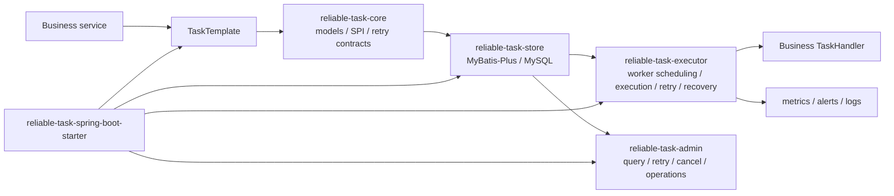

# ReliableTask

ReliableTask is a reliable asynchronous task execution framework for Spring Boot applications.
It persists business tasks in MySQL, executes them with workers, retries recoverable failures,
recovers timed-out executions, and exposes admin APIs for operational visibility.

[English](README.md) | [中文](README.zh-CN.md)

[](https://openjdk.org/projects/jdk/21/)
[](https://spring.io/projects/spring-boot)
[](https://baomidou.com/)
[](https://github.com/naruto863/reliable-task/actions/workflows/ci.yml)
[](LICENSE)

> ReliableTask `v0.1.0` is the first public preview release. APIs, configuration, and database schema may evolve before `v1.0.0`.

## Table of Contents

- [Why ReliableTask](#why-reliabletask)
- [Features](#features)
- [Architecture](#architecture)
- [Modules](#modules)
- [Requirements](#requirements)
- [Quick Start](#quick-start)
- [Installation](#installation)
- [Configuration](#configuration)
- [Security](#security)
- [Testing](#testing)
- [FAQ](#faq)
- [Release](#release)
- [Contributing](#contributing)
- [License](#license)

## Why ReliableTask

ReliableTask is designed for business workflows where a database transaction must create durable follow-up work,
such as sending notifications, issuing coupons, synchronizing data, or triggering compensation tasks.

It is not a general-purpose message queue. The current preview focuses on a database-backed execution model:
write the business record and the task record in one transaction, then let workers claim, execute, retry, and recover tasks.

## Features

| Feature | Description |
| --- | --- |
| Transactional task submission | Submit reliable asynchronous tasks in the same transaction as business data. |
| Database-backed lifecycle | Store task state, logs, worker heartbeat, audit logs, and batch operation records in MySQL. |
| Retry strategies | Use fixed interval or exponential backoff retry policies, with handler-level overrides. |
| Timeout recovery | Detect timed-out running tasks and reset them after worker crashes or abnormal exits. |
| Thread pool isolation | Configure task-type-specific pools to isolate slow or high-risk workloads. |
| Idempotency SPI | Control duplicate submission and duplicate execution behavior through pluggable strategies. |
| Admin APIs | Query tasks, view logs and stats, retry, requeue, cancel, update payloads, and inspect workers. |
| Spring Boot starter | Enable store, executor, admin APIs, metrics, serializer, idempotency, and worker settings through auto-configuration. |

## Architecture



Execution flow:

1. A business service calls `TaskTemplate` inside a transaction.
2. `reliable-task-store` persists the task record in MySQL with business data.
3. Workers claim executable tasks by status, next execution time, and priority.
4. `TaskHandler` executes business logic and writes success, failure, retry, or terminal state changes.
5. Recovery scans timed-out running tasks and reduces the impact of abnormal worker exits.
6. Admin APIs provide task queries, manual operations, stats, audit logs, and worker views.

## Modules

| Module | Responsibility |
| --- | --- |
| `reliable-task-core` | Core models, SPI contracts, enums, exceptions, retry strategy contracts, and task submission APIs. |
| `reliable-task-store` | MyBatis-Plus storage implementation and MySQL schema. |
| `reliable-task-executor` | Worker scheduling, task execution, retry, recovery, serialization, heartbeat, and thread pool management. |
| `reliable-task-admin` | Management REST APIs and metrics collection. |
| `reliable-task-spring-boot-starter` | Spring Boot auto-configuration and configuration metadata. |
| `reliable-task-demo` | Runnable demo application and local cURL scripts. |

## Requirements

| Tool | Version |
| --- | --- |
| Java | 21+ |
| Maven | 3.8+ |
| Spring Boot | 3.2.5 |
| MyBatis-Plus | 3.5.6 |
| MySQL | 8.0+ |

MySQL is required for the runnable demo. The test suite primarily uses unit tests, Spring Boot auto-configuration tests, and H2 schema validation.

## Quick Start

### 1. Clone the repository

```bash
git clone https://github.com/naruto863/reliable-task.git
cd reliable-task
```

### 2. Initialize MySQL

```sql
CREATE DATABASE reliable_task DEFAULT CHARACTER SET utf8mb4 COLLATE utf8mb4_unicode_ci;
```

```bash
mysql -u reliable_task_user -p reliable_task < reliable-task-store/src/main/resources/db/schema.sql
```

### 3. Prepare local demo configuration

Real local configuration is ignored by Git. Copy the example file and override sensitive values locally:

```bash
cp reliable-task-demo/src/main/resources/application-example.yml reliable-task-demo/src/main/resources/application.yml
```

You can also use environment variables:

```bash
export RELIABLE_TASK_DATASOURCE_URL="jdbc:mysql://localhost:3306/reliable_task?useUnicode=true&characterEncoding=utf-8&serverTimezone=Asia/Shanghai"
export RELIABLE_TASK_DATASOURCE_USERNAME="reliable_task_user"
export RELIABLE_TASK_DATASOURCE_PASSWORD="change_me"
```

### 4. Build and test

```bash
mvn -B test
```

### 5. Run the demo

```bash
mvn -pl reliable-task-demo -am spring-boot:run
```

### 6. Verify the demo

```bash
curl -X POST "http://localhost:8080/demo/order?orderNo=ORD-001&buyerId=USER-123"
curl -H "X-Operator: admin" "http://localhost:8080/api/reliable-task/tasks"
curl -H "X-Operator: admin" "http://localhost:8080/api/reliable-task/tasks/stats"
```

More demo requests are documented in [reliable-task-demo/README.md](reliable-task-demo/README.md).

## Installation

ReliableTask `v0.1.0` is not published to Maven Central yet. For this preview release, use a source build, local Maven installation, or a private Maven repository.

```bash
mvn -B -DskipTests install
```

Then depend on the Spring Boot starter:

```xml
<dependency>
    <groupId>com.reliabletask</groupId>
    <artifactId>reliable-task-spring-boot-starter</artifactId>
    <version>0.1.0</version>
</dependency>
```

### Minimal Configuration

```yaml
spring:
  datasource:
    url: ${RELIABLE_TASK_DATASOURCE_URL}
    username: ${RELIABLE_TASK_DATASOURCE_USERNAME}
    password: ${RELIABLE_TASK_DATASOURCE_PASSWORD}

reliable-task:
  enabled: true
  worker:
    enabled: true
  recovery:
    enabled: true
  admin:
    enabled: true
```

### Implement a TaskHandler

```java
@TaskHandler("SEND_EMAIL")
@TaskRetryable(maxRetryCount = 3, retryIntervalMs = 2000)
public class SendEmailHandler implements com.reliabletask.core.spi.TaskHandler {

    @Override
    public String getTaskType() {
        return "SEND_EMAIL";
    }

    @Override
    public void execute(TaskInstance task) throws Exception {
        // Execute your business logic here.
    }
}
```

### Submit Tasks in a Transaction

```java
@Service
@RequiredArgsConstructor
public class OrderService {

    private final TaskTemplate taskTemplate;

    @Transactional
    public void createOrder(String orderNo) {
        // 1. Persist business data.
        // 2. Submit a durable asynchronous task in the same transaction.
        taskTemplate.submit(TaskSubmitRequest.builder()
            .taskType("SEND_EMAIL")
            .bizType("ORDER")
            .bizId(orderNo)
            .payload("{\"to\":\"user@example.com\"}")
            .build());
    }
}
```

## Configuration

ReliableTask properties use the `reliable-task` prefix.

| Property | Default | Description |
| --- | --- | --- |
| `reliable-task.enabled` | `true` | Enables the framework. |
| `reliable-task.worker.enabled` | `true` | Enables worker polling and execution. |
| `reliable-task.worker.poll-interval-ms` | `5000` | Worker polling interval. |
| `reliable-task.worker.batch-size` | `10` | Number of tasks fetched per polling batch. |
| `reliable-task.recovery.enabled` | `true` | Enables timeout recovery scans. |
| `reliable-task.metrics.enabled` | `false` | Enables Micrometer metrics recording. |
| `reliable-task.alert.enabled` | `false` | Enables alert scanning. |
| `reliable-task.admin.enabled` | `true` | Enables admin APIs. |
| `reliable-task.admin.auth.enabled` | `false` | Enables admin authorization SPI checks. |
| `reliable-task.admin.audit.enabled` | `false` | Enables admin operation auditing. |
| `reliable-task.admin.batch.enabled` | `false` | Enables limited batch operation APIs. |

See [application-example.yml](reliable-task-demo/src/main/resources/application-example.yml) for a runnable demo configuration.

## Security

- Do not commit real `application.yml`, `.env`, database credentials, tokens, cookies, internal URLs, or private keys.
- Keep local configuration in ignored files or environment variables.
- `application-example.yml` and `.env.example` must contain placeholders only.
- Admin APIs are suitable for local demos by default. Before production use, add authentication, authorization, audit logging, monitoring, and network access controls.
- Report vulnerabilities through [SECURITY.md](SECURITY.md). Do not disclose exploitable details in public issues.

## Testing

```bash
mvn -B test
```

The default test suite should not require a local MySQL instance. Real MySQL is only needed for the runnable demo flow.

## FAQ

### Is ReliableTask a message queue?

No. ReliableTask is not Kafka, RabbitMQ, RocketMQ, or a general-purpose MQ replacement.
It focuses on database-backed reliable business task execution where task submission should be committed with business data.

### Why is `application.yml` ignored?

`application.yml` often contains local credentials, internal addresses, and environment-specific values.
The repository keeps only `.env.example` and `application-example.yml` with placeholders.

### Can Admin APIs be exposed directly in production?

No. Do not expose admin write APIs directly to the public internet.
Production deployments must add authentication, authorization, audit logging, network access control, and monitoring.

### Is `v0.1.0` available on Maven Central?

Not yet. Use a source build, local Maven installation, or a private Maven repository for the preview release.

### What compatibility does `0.x` provide?

`0.x` is a preview stage. APIs and database schema may change before `v1.0.0`.
Breaking changes, security fixes, and migration notes should be recorded in [CHANGELOG.md](CHANGELOG.md).

## Release

- Versioning follows SemVer.
- Git tags use `vX.Y.Z`, for example `v0.1.0`.
- Release notes are maintained in [CHANGELOG.md](CHANGELOG.md) and [docs/releases](docs/releases).
- The release process is documented in [docs/release-process.md](docs/release-process.md).
- The first public preview release is `v0.1.0`.

## Contributing

Issues and pull requests are welcome. Please read [CONTRIBUTING.md](CONTRIBUTING.md) before submitting changes.

Pull requests should include the change scope, test results, compatibility impact, and security impact when relevant.

## License

ReliableTask is licensed under the [Apache License 2.0](LICENSE).
