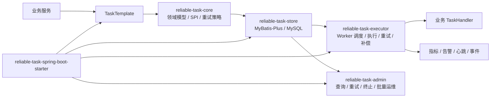

# ReliableTask

[English](README.md) | [中文](README.zh-CN.md)

ReliableTask 是一个基于 Spring Boot 3 的可靠异步任务执行框架，面向“业务事务提交后需要稳定执行异步动作”的场景。

它提供事务内任务投递、数据库任务存储、Worker 调度、自动重试、超时补偿、线程池隔离、管理 API 和 Spring Boot Starter 自动装配能力。

[](https://openjdk.org/projects/jdk/17/)
[](https://spring.io/projects/spring-boot)
[](https://baomidou.com/)
[](https://github.com/naruto863/reliable-task/actions/workflows/ci.yml)
[](LICENSE)

> 当前预览版本为 `v0.5.0`。生产使用前请完成数据库备份、Admin 鉴权、监控告警和容量评估。

## 目录

- [核心能力](#核心能力)
- [适用与不适用场景](#适用与不适用场景)
- [项目目录结构](#项目目录结构)
- [架构总览](#架构总览)
- [可靠性语义](#可靠性语义)
- [技术栈](#技术栈)
- [快速开始](#快速开始)
- [接入方式](#接入方式)
- [配置说明](#配置说明)
- [Admin 运维查询](#admin-运维查询)
- [生产接入 Checklist](#生产接入-checklist)
- [安全说明](#安全说明)
- [测试](#测试)
- [常见问题](#常见问题)
- [版本与发布](#版本与发布)
- [贡献](#贡献)
- [License](#license)

## 核心能力

| 能力 | 说明 |
| --- | --- |
| 事务内投递 | 在业务事务中写入任务，业务数据和任务记录同提交、同回滚 |
| 显式状态机 | 集中约束 `PENDING/RETRYING -> RUNNING -> SUCCESS/RETRYING/DEAD/CANCELLED` 等状态流转 |
| 自动重试 | 支持固定间隔、带 jitter 的指数退避和注册型自定义策略，异常任务可按策略进入重试队列 |
| 锁与超时控制 | 支持 Worker 抢占锁 TTL 配置、超时恢复阈值和执行超时中断 |
| 线程池与 Handler 隔离 | 按任务类型配置线程池，并落地 `TaskHandler.maxConcurrency()` |
| 幂等支持 | 提供幂等策略 SPI 和默认策略，控制重复投递；执行端外部副作用幂等由业务 Handler 负责 |
| 失败分类 | 可通过 `FailureClassifier` Bean 覆盖 retry/dead 决策；默认保持 `NonRetryableException -> DEAD` |
| 失败诊断 | 通过异常格式化 SPI 输出错误码、摘要和压缩堆栈 |
| 任务事件监听 | 可监听 submit、start、success、retry、dead、cancel、requeue、recovery 等轻量状态事件 |
| 死信处理 SPI | 可注册 `TaskDeadLetterHandler` Bean 承接 post-DEAD 通知、归档或补偿流程；默认 no-op |
| 管理 API | 提供任务查询、v0.5 运维视图、重试、终止、重新入队、统计和 Worker 查询等接口 |
| Starter 接入 | 通过 Spring Boot 自动装配减少业务应用接入成本 |

## 适用与不适用场景

开发业务系统时，很多异步动作并不复杂，却很容易卡在可靠性上：

- 订单、支付、发货等业务事务已经提交，但后续发券、通知、同步第三方系统不能丢。
- 直接用 `@Async` 或本地线程池很轻便，但进程重启、线程池拒绝、代码异常后缺少持久化状态，任务可能悄悄丢失。
- 把外部 HTTP、RPC、MQ 调用放进业务事务里会拉长事务时间，外部系统抖动还可能拖慢核心链路。
- 使用事务提交后的回调可以避开事务内阻塞，但失败重试、超时恢复、死信处理和人工排查仍要自己补齐。
- 为少量内部可靠任务单独引入 MQ 有时过重，事务一致性、消息幂等、死信运维和链路追踪都需要额外建设。
- 用定时任务扫描业务表也能做补偿，但重试次数、下次执行时间、失败原因、并发抢占和操作审计容易散落在各处。

ReliableTask 适合这类场景：

- Spring Boot 应用已经使用 MySQL，希望用数据库 Outbox 模型承接事务后的可靠异步动作。
- 任务与业务数据需要同提交、同回滚，例如创建订单后发券、支付成功后通知、发货后同步外部系统。
- 任务量中等，更看重可追踪、可重试、可补偿、可人工处理，而不是极致吞吐和毫秒级延迟。
- 业务 Handler 能按业务键做好幂等，能够接受 at-least-once 执行语义。
- 团队希望少引入一个独立消息中间件，先用业务数据库和统一的任务表、日志表、管理 API 解决内部可靠任务。

ReliableTask 不适合这些场景：

- 需要 Kafka、RabbitMQ、RocketMQ 这类通用消息队列能力，例如跨系统发布订阅、流式处理、广播消费或超高吞吐削峰。
- 需要 exactly-once 外部副作用保证。ReliableTask 只能保证至少一次调度，外部接口、扣款、发货、发消息仍要靠业务幂等兜底。
- 需要复杂工作流编排、人工审批流、长时间 Saga 状态机或可视化流程引擎，这类场景更适合 Temporal、Flowable、Camunda 等专门系统。
- 主要需求是 cron、报表批处理、离线大任务或纯延迟调度，而不是由业务事务产生的可靠后续动作。
- 应用不能使用 MySQL，或不允许新增任务表、日志表、Worker 表等持久化结构。
- 任务失败后没有明确的业务补偿方式，也无法提供稳定幂等键，此时先梳理业务语义比接入框架更重要。

## 项目目录结构

```text
reliable-task
├── reliable-task-core                 # 领域模型、SPI、枚举、异常、重试策略
├── reliable-task-store                # MyBatis-Plus 存储实现和 MySQL schema
├── reliable-task-executor             # Worker 调度、任务执行、重试、补偿、线程池
├── reliable-task-admin                # 管理 API、任务运维接口、指标收集
├── reliable-task-spring-boot-starter  # Spring Boot 自动装配和配置属性
├── reliable-task-demo                 # 可运行 Demo 工程
├── docs                               # 发布流程、开源检查报告等维护文档
└── .github                            # CI、Issue 模板、PR 模板
```

模块职责：

| 模块 | 职责 |
| --- | --- |
| `reliable-task-core` | 领域模型、SPI、枚举、异常、重试策略 |
| `reliable-task-store` | MyBatis-Plus 存储实现和 MySQL 表结构 |
| `reliable-task-executor` | 任务执行、Worker 调度、重试、补偿、线程池 |
| `reliable-task-admin` | 管理 API、任务运维接口、指标收集 |
| `reliable-task-spring-boot-starter` | 自动装配和配置属性 |
| `reliable-task-demo` | 可运行示例工程 |

## 架构总览

ReliableTask 的核心思路是把“业务事务提交后必须可靠执行的异步动作”先持久化为任务，再由 Worker 以可重试、可补偿、可观测的方式执行。它不依赖外部 MQ，当前预览版以 MySQL 作为任务状态和执行日志的事实来源。



执行链路：

1. 业务代码在事务中调用 `TaskTemplate` 投递任务。
2. `reliable-task-store` 将任务写入 MySQL，任务记录与业务事务保持一致。
3. Worker 按状态、下次执行时间、优先级拉取任务并抢占执行。
4. `TaskHandler` 执行业务动作；成功、失败、重试、死信状态都会回写任务表和日志表。
5. 补偿扫描会发现超时运行中的任务，降低 Worker 异常退出导致任务卡死的风险。
6. Admin API 用于任务查询、v0.5 运维视图、人工重试、终止、重新入队、统计和 Worker 状态查看。

## 可靠性语义

ReliableTask 基于数据库 Outbox 模型，提供 at-least-once（至少一次）执行语义，不提供 exactly-once（精确一次）执行语义。

任务投递和业务数据写入同一个本地事务。业务事务提交时，任务记录一起提交；业务事务回滚时，任务记录也会回滚。`TaskHandler` 由 Worker 在事务提交之后异步执行，它不是事务内回调，也不是 after-commit 回调。

投递幂等基于最终写入的 `bizUniqueKey`，并由任务表唯一键约束。默认格式为 `taskType:bizType:bizId`；业务方也可以通过 `TaskSubmitRequest.idempotencyKey` 显式传入稳定业务键。重复投递可能返回已有任务，而不是创建新任务。

同一个业务动作的 `TaskHandler` 仍可能被调用多次。常见原因包括可重试失败、Handler 超时、Worker 崩溃、租约恢复、旧 Worker 在中断请求后仍继续执行，以及人工重新入队。超时处理会调用 `Future.cancel(true)` 请求线程中断，但无法保证外部 HTTP、RPC、MQ 或数据库副作用已经停止。

生产 Handler 必须自行保证幂等。推荐做法：

- 为每类任务定义稳定的业务幂等键，例如订单号、支付单号、发货单号或外部请求号。
- 调用支持幂等键的外部 API 时，传入同一个业务幂等键。
- 对不可幂等的外部系统，先写本地副作用表或操作流水，并通过唯一约束防重复。
- 在写入、发送、扣款、发券前检查该副作用是否已经完成。
- 将 `DEAD`、重试、超时和恢复事件视为运维信号，而不是“外部副作用一定没有发生”的证明。

## 技术栈

| 技术 | 版本 |
| --- | --- |
| Java | 17+ |
| Maven | 3.8+ |
| Spring Boot | 3.2.5 |
| MyBatis-Plus | 3.5.6 |
| MySQL | 8.0+ |
| JUnit | 5 |

## 快速开始

### 1. 克隆仓库

```bash
git clone https://github.com/naruto863/reliable-task.git
cd reliable-task
```

### 2. 初始化数据库

```sql
CREATE DATABASE reliable_task DEFAULT CHARACTER SET utf8mb4 COLLATE utf8mb4_unicode_ci;
```

```bash
mysql -u reliable_task_user -p reliable_task < reliable-task-store/src/main/resources/db/schema.sql
```

### 3. 准备 Demo 配置

`application.yml` 已被 `.gitignore` 忽略，请从示例文件生成本地配置并填入自己的数据库信息：

```bash
cp reliable-task-demo/src/main/resources/application-example.yml reliable-task-demo/src/main/resources/application.yml
```

推荐使用环境变量覆盖敏感配置：

```bash
export RELIABLE_TASK_DATASOURCE_URL="jdbc:mysql://localhost:3306/reliable_task?useUnicode=true&characterEncoding=utf-8&serverTimezone=Asia/Shanghai"
export RELIABLE_TASK_DATASOURCE_USERNAME="reliable_task_user"
export RELIABLE_TASK_DATASOURCE_PASSWORD="change_me"
```

### 4. 编译和测试

```bash
mvn -B test
```

### 5. 启动 Demo

```bash
mvn -pl reliable-task-demo -am spring-boot:run
```

### 6. 验证 Demo

```bash
curl -X POST "http://localhost:8080/demo/order?orderNo=ORD-001&buyerId=USER-123"
curl -H "X-Operator: admin" "http://localhost:8080/api/reliable-task/tasks"
curl -H "X-Operator: admin" "http://localhost:8080/api/reliable-task/tasks/stats"
```

## 接入方式

当前 `0.5.0` 预览阶段默认通过源码构建后在本地或私有仓库引用，尚未发布到 Maven Central。

```xml
<dependency>
    <groupId>com.reliabletask</groupId>
    <artifactId>reliable-task-spring-boot-starter</artifactId>
    <version>0.5.0</version>
</dependency>
```

### 最小配置示例

```yaml
spring:
  datasource:
    url: ${RELIABLE_TASK_DATASOURCE_URL}
    username: ${RELIABLE_TASK_DATASOURCE_USERNAME}
    password: ${RELIABLE_TASK_DATASOURCE_PASSWORD}

reliable-task:
  enabled: true
  worker:
    enabled: true
    batch-size: 10
    max-batch-size: 1000
    lock-ttl-seconds: 300
  recovery:
    enabled: true
    timeout-seconds: 300
    max-reset-per-scan: 100
  retry:
    exponential-multiplier: 2.0
    jitter-ratio: 0.0
    min-delay-ms: 0
    max-delay-ms: 300000
  admin:
    enabled: false
    write-enabled: false
    max-page-size: 200
    max-batch-limit: 1000
    query:
      default-window-hours: 24
      max-window-days: 30
      default-limit: 50
      max-limit: 200
      slow-threshold-ms: 30000
    audit:
      enabled: false
    auth:
      enabled: true
    batch:
      enabled: false
```

可运行 Demo 会为了本地体验显式设置 `admin.enabled=true`、`write-enabled=true`、`auth.enabled=false`。这些 Demo 配置不是生产默认值。

### 实现 TaskHandler

```java
@TaskHandler("SEND_EMAIL")
@TaskRetryable(maxRetryCount = 3, retryIntervalMs = 2000)
public class SendEmailHandler implements com.reliabletask.core.spi.TaskHandler {

    @Override
    public String getTaskType() {
        return "SEND_EMAIL";
    }

    @Override
    public void execute(TaskInstance task) throws Exception {
        // 在这里执行你的业务逻辑。
    }
}
```

### 在事务中投递任务

```java
@Service
@RequiredArgsConstructor
public class OrderService {

    private final TaskTemplate taskTemplate;

    @Transactional
    public void createOrder(String orderNo) {
        // 1. 保存业务数据。
        // 2. 在同一个事务内投递异步任务。
        taskTemplate.submit(TaskSubmitRequest.builder()
            .taskType("SEND_EMAIL")
            .bizType("ORDER")
            .bizId(orderNo)
            .idempotencyKey("send-email:order:" + orderNo)
            .payload("{\"to\":\"user@example.com\"}")
            .build());
    }
}
```

如果不传 `idempotencyKey`，ReliableTask 保持兼容的 `taskType:bizType:bizId` 生成规则；如果传入，则会 trim 后直接作为 `bizUniqueKey` 入库。该值不能为空白，长度不能超过 256 字符。建议使用稳定业务标识，避免把手机号、身份证、Token、凭证或大段 payload 原文放进 key。

### 自定义重试策略

`RetryStrategyType.CUSTOM` 通过 Spring 中注册的 `RetryStrategy` Bean 解析。未注册自定义策略时，`CUSTOM` 仍会快速失败，不会静默降级成内置策略。

```java
@Bean
RetryStrategy customRetryStrategy() {
    return new RetryStrategy() {
        @Override
        public RetryStrategyType getType() {
            return RetryStrategyType.CUSTOM;
        }

        @Override
        public long nextDelayMs(int retryCount, long intervalMs, long maxDelayMs) {
            return Math.min(10_000L, maxDelayMs);
        }
    };
}
```

内置 `EXPONENTIAL` 策略支持 `reliable-task.retry.jitter-ratio`；默认值为 `0.0`，因此不启用 jitter 时现有延迟行为保持不变。

### 自定义失败分类

默认情况下，`NonRetryableException` 会直接进入 `DEAD`，其他异常会在未耗尽 `maxRetryCount` 时进入重试。业务方可以提供 `FailureClassifier` Bean 覆盖 retry/dead 决策。

```java
@Bean
FailureClassifier failureClassifier() {
    return (task, error) -> {
        if (error instanceof RemoteBadRequestException) {
            return FailureDecision.dead("remote 4xx");
        }
        return FailureDecision.retry("temporary failure");
    };
}
```

如果 classifier 自身抛异常，ReliableTask 会记录 warn，并回退到默认分类器。

### 任务事件监听

业务方可以提供一个或多个 `TaskEventListener` Bean 监听轻量任务状态事件。监听器会在状态写入成功后按 Spring Bean 顺序同步调用；单个监听器异常会被记录并隔离，不会阻塞其他监听器，也不会回滚已经写入的任务状态。

```java
@Bean
TaskEventListener taskEventListener() {
    return event -> log.info("task event: type={}, taskId={}, before={}, after={}",
            event.getEventType(),
            event.getTaskId(),
            event.getStatusBefore(),
            event.getStatusAfter());
}
```

当前会发布投递、Worker 抢占开始、执行成功、安排重试、进入 DEAD、人工取消、人工重新入队/重试、超时恢复等事件。该能力不是通用事件总线，不提供异步监听队列，也不是完整事件溯源历史。

### 死信处理 SPI

`TaskDeadLetterHandler` 是 post-DEAD 扩展点，可用于通知、归档或补偿代码。Starter 默认注册 no-op handler 和 `TaskDeadLetterDispatcher`。多个 handler Bean 会在任务状态成功写入 `DEAD` 后按 Spring Bean 顺序同步调用；单个 handler 异常只记录并隔离。

```java
@Bean
TaskDeadLetterHandler taskDeadLetterHandler() {
    return context -> log.warn("dead task: taskId={}, type={}, errorCode={}, reason={}",
            context.getTask().getId(),
            context.getTask().getTaskType(),
            context.getErrorCode(),
            context.getReason());
}
```

## 配置说明

常用配置前缀为 `reliable-task`：

| 配置项 | 默认值 | 说明 |
| --- | --- | --- |
| `reliable-task.enabled` | `true` | 框架总开关 |
| `reliable-task.worker.enabled` | `true` | Worker 拉取和执行开关 |
| `reliable-task.worker.poll-interval-ms` | `5000` | Worker 拉取间隔 |
| `reliable-task.worker.batch-size` | `10` | 单次拉取数量 |
| `reliable-task.worker.max-batch-size` | `1000` | Worker 单次拉取数量上限，超出时自动裁剪 |
| `reliable-task.worker.lock-ttl-seconds` | `300` | Worker 抢占任务后的初始锁 TTL |
| `reliable-task.recovery.enabled` | `true` | 超时补偿扫描开关 |
| `reliable-task.recovery.timeout-seconds` | `300` | 兼容保留配置；当前恢复以 `lock_expire_at <= now` 为准，不再在锁过期后叠加第二段宽限等待 |
| `reliable-task.recovery.max-reset-per-scan` | `100` | 单次恢复扫描最多加载并重置的过期 RUNNING 任务数量 |
| `reliable-task.retry.exponential-multiplier` | `2.0` | 内置 `EXPONENTIAL` 重试策略的增长倍数 |
| `reliable-task.retry.jitter-ratio` | `0.0` | `EXPONENTIAL` 的 jitter 比例；`0` 表示关闭，合法范围是 `0..1` |
| `reliable-task.retry.min-delay-ms` | `0` | 策略计算后应用的最小重试延迟 |
| `reliable-task.retry.max-delay-ms` | `300000` | 未设置 `@TaskRetryable.maxDelayMs` 时使用的默认最大重试延迟 |
| `reliable-task.metrics.enabled` | `false` | Micrometer 指标开关 |
| `reliable-task.metrics.include-worker-id-tag` | `false` | 是否在执行指标中附加 `worker_id` tag；默认关闭以避免高基数时序 |
| `reliable-task.metrics.stats-cache-ttl-ms` | `5000` | 任务统计 Gauge 快照缓存时间，避免一次 scrape 多次查询统计 |
| `reliable-task.alert.enabled` | `false` | 告警扫描开关 |
| `reliable-task.admin.enabled` | `false` | 管理 REST API 注册开关；默认关闭，需显式开启；写操作由单独开关控制 |
| `reliable-task.admin.write-enabled` | `false` | Admin 写接口开关，包括重试、终止、重新入队、更新 payload 和批量操作 |
| `reliable-task.admin.max-page-size` | `200` | Admin 列表查询 pageSize 上限，超出时自动裁剪 |
| `reliable-task.admin.max-batch-limit` | `1000` | Admin 批量操作 limit 上限，超出时自动裁剪 |
| `reliable-task.admin.query.default-window-hours` | `24` | 新增运维查询未传显式时间范围时使用的默认时间窗口 |
| `reliable-task.admin.query.max-window-days` | `30` | 新增运维查询允许的最大时间跨度 |
| `reliable-task.admin.query.default-limit` | `50` | 新增运维查询默认返回条数 |
| `reliable-task.admin.query.max-limit` | `200` | 新增运维查询最大返回条数 |
| `reliable-task.admin.query.slow-threshold-ms` | `30000` | 慢任务运维查询默认耗时阈值，单位毫秒 |
| `reliable-task.admin.auth.enabled` | `true` | Admin 权限 SPI 开关；Admin API 显式注册后默认启用权限检查 |
| `reliable-task.admin.audit.enabled` | `false` | Admin 操作审计和审计日志查询开关 |
| `reliable-task.admin.batch.enabled` | `false` | 批量运维 API 开关，关闭时接口返回 404 |

`admin.query.*` 默认值只作用于 v0.5 新增的运维查询，例如最近失败、慢任务、失败聚合和 timeline 相关列表视图。现有 `/tasks` 和 `/audit-logs` 列表接口保持兼容过滤行为，不会被自动追加 24 小时时间窗口。

以下兼容保留配置在 `0.5.0` 中仍可绑定，但不会改变运行行为：`reliable-task.serializer.type` 不会切换序列化器，如需自定义请提供 `TaskPayloadSerializer` Bean；`reliable-task.store.table-prefix` 不会改变 MyBatis 表名；`reliable-task.admin.port` 和 `reliable-task.admin.context-path` 不会创建独立管理端口，也不会改变当前 `/api/reliable-task` 映射。

完整示例见 [application-example.yml](reliable-task-demo/src/main/resources/application-example.yml)。该示例是本地 Demo 的显式 opt-in 配置，不代表生产默认值。

Micrometer 执行类 counter/timer 默认只使用低基数的 `task_type` 和 `status` tag。队列健康指标包括 `reliable_task_backlog_total`、`reliable_task_oldest_pending_age_seconds`、pending/running/dead 总量、Worker 可用容量，以及基于恢复事件累加的 `reliable_task_recovered_total`。

生产监控和事故响应模板见 [monitoring guide](docs/operations/reliable-task-monitoring.md)、[runbook](docs/operations/reliable-task-runbook.md) 和 [Prometheus alerts example](docs/operations/prometheus-alerts-example.yml)。

## Admin 运维查询

ReliableTask v0.5 新增有边界的只读 Admin 运维查询，用于生产排障。调用方未显式传时间范围或 limit 时，这些查询使用 `admin.query.*` 默认值。现有 `/tasks` 和 `/audit-logs` 列表接口保持兼容行为，不会被自动追加默认时间窗口。

| Endpoint | 用途 | 主要参数 |
| --- | --- | --- |
| `GET /api/reliable-task/tasks/recent-failures` | 查询最近失败执行记录 | `taskType`、`errorCode`、`createTimeStart`、`createTimeEnd`、`limit` |
| `GET /api/reliable-task/tasks/slow` | 查询慢执行记录 | `taskType`、`durationMsGte`、`createTimeStart`、`createTimeEnd`、`limit` |
| `GET /api/reliable-task/tasks/failure-top` | 查询失败 Top 聚合 | `groupBy`、`taskType`、`createTimeStart`、`createTimeEnd`、`limit` |
| `GET /api/reliable-task/tasks/{id}/timeline` | 查询单任务生命周期 | `id` |

默认口径：未传时间范围时查询最近 24 小时；`limit` 默认 50，最大裁剪到 200；慢任务默认阈值为 `durationMsGte=30000`。最近失败来自执行日志中的失败结果，慢任务按 `durationMs` 倒序返回。这些列表视图会返回错误摘要，避免无界返回完整堆栈。
失败 Top 默认使用 `groupBy=taskType,errorCode`，只支持 `taskType`、`errorCode`、`taskType,errorCode` 三种聚合维度；非法 `groupBy` 返回 400。空错误码统一归入 `UNKNOWN`，`failure-top` 使用更小的默认 `limit=20`，最大裁剪到 100。
Timeline 会合并任务主表、执行日志和 Admin 审计日志，按事件时间升序返回；同一时间按 `SUBMITTED -> LOG -> AUDIT -> CURRENT` 稳定排序。它是轻量排障视图，不是完整事件溯源历史；审计关闭时仍会返回提交、执行日志和当前状态部分。

## 生产接入 Checklist

在非 Demo 环境使用 ReliableTask 前，请至少确认：

- 数据库：使用 MySQL 8+，执行 `schema.sql`，使用专用数据库账号，配置备份，并规划任务表、日志表、审计表、Worker 表和批量操作表的容量、保留周期和归档策略。
- 容量参数：根据吞吐量设置 `worker.batch-size`、`worker.max-batch-size`、线程池、队列容量和 `recovery.max-reset-per-scan`；Admin pageSize 和 batch limit 必须有上限。
- Handler 幂等：为每个任务类型定义业务幂等键，保护外部副作用，设置明确的 HTTP/RPC 超时，并区分可重试和不可重试异常。
- Payload 与诊断信息：不要在任务 payload、错误信息、审计详情、幂等键或日志中保存凭据、Token、私钥、个人身份标识原文或敏感客户数据。
- 租约与恢复：根据真实 Handler 耗时设置 `worker.lock-ttl-seconds` 和 Handler `timeoutMs()`；上线前用真实 MySQL 集成测试验证恢复语义。
- Admin 安全：Admin API 应只暴露在内部运维网络；生产保持 `reliable-task.admin.auth.enabled=true`，默认关闭写接口；如需开启，必须接入认证、授权、审计、网络访问控制和操作人追踪。
- 可观测性：为待执行积压、最老待执行任务、重试率、死信任务、恢复次数、失联 Worker 和 Worker 可用容量建立日志、指标、告警和看板；按 [monitoring guide](docs/operations/reliable-task-monitoring.md) 和 [Prometheus alerts example](docs/operations/prometheus-alerts-example.yml) 调整阈值，不要直接把示例阈值当成生产标准。
- Runbook：上线前演练 [production runbook](docs/operations/reliable-task-runbook.md) 中的 backlog 增长、死信激增、重试风暴、恢复次数升高、Worker 失联和 Admin 写操作流程。
- 验证：发布前执行 `mvn -B test`，并至少执行一种真实 MySQL profile（`mysql-it` 或 `mysql-local-it`）；被环境阻塞的验证必须单独记录，不能写成已通过。

## 安全说明

- 不要提交 `application.yml`、`.env`、真实数据库账号、真实密码、Token、Cookie 或内部地址。
- Demo 的 `application-example.yml` 只包含占位符，真实配置应放在本地环境变量或私有配置中心。
- Admin REST API 默认关闭。仅在本地 Demo 或受保护的内部运维场景启用 `reliable-task.admin.enabled=true`；生产环境应保持 `reliable-task.admin.auth.enabled=true`，只有在完成认证、授权、审计、监控和网络访问控制后才启用 `reliable-task.admin.write-enabled=true`。
- 如果发现漏洞或敏感信息泄露，请按 [SECURITY.md](SECURITY.md) 处理，不要直接公开披露。

## 测试

```bash
mvn -B test
```

默认测试不应依赖 Docker 或本地 MySQL。

真实 MySQL 集成测试通过 `mysql-it` Maven profile 显式开启，并使用 Testcontainers：

```bash
mvn -B -Pmysql-it -pl reliable-task-store,reliable-task-executor -am test
```

如果 Docker 不可用，同一批 `*IT` 测试也可以连接专用的本地 MySQL 8 测试库：

```cmd
set RELIABLE_TASK_IT_JDBC_URL=jdbc:mysql://localhost:3306/reliable_task_it?useUnicode=true^&characterEncoding=utf-8^&serverTimezone=Asia/Shanghai
set RELIABLE_TASK_IT_USERNAME=reliable_task_it
set RELIABLE_TASK_IT_PASSWORD=change_me
mvn -B -Pmysql-local-it -pl reliable-task-store,reliable-task-executor -am test
```

本地 profile 只允许使用可丢弃的集成测试库；测试会初始化 ReliableTask schema 并写入测试数据。如果 Docker/Testcontainers 和本地 MySQL 都不可用，请记录环境证据，并单独执行默认 `mvn -B test`。不要把跳过或被环境阻塞的 MySQL 集成测试描述为已经验证通过。

## 常见问题

### ReliableTask 和 MQ 是什么关系？

ReliableTask 不是通用消息队列，也不替代 Kafka、RabbitMQ、RocketMQ 等 MQ。它更适合“业务事务提交后必须可靠执行一个业务动作”的场景，例如发货、发券、补偿同步、异步通知。当前实现用数据库保存任务状态，重点是事务一致性、重试、补偿和可运维性。

### ReliableTask 能保证 exactly-once 吗？

不能。ReliableTask 提供 at-least-once 执行语义。框架会通过状态和租约校验降低重复状态回写风险，但业务 Handler 和外部系统仍必须能承受重复调用。

### 为什么不提交 `application.yml`？

`application.yml` 通常包含数据库账号、密码、内部地址或本地环境配置，不适合开源提交。仓库只保留 `.env.example` 和 `application-example.yml`，真实配置应放在本地环境变量、私有配置中心或被 `.gitignore` 忽略的本地配置文件中。

### Admin API 可以直接用于生产吗？

不建议直接暴露。Admin REST API 默认关闭；如需启用 `reliable-task.admin.enabled=true`，生产环境应保持权限检查开启。如还需启用 `reliable-task.admin.write-enabled=true`，必须接入认证、授权、审计、网络访问控制和操作权限限制，尤其要保护重试、终止、重新入队、更新 payload 等写操作。

### 当前版本是否已经发布到 Maven Central？

还没有。`0.5.0` 预览阶段默认通过源码构建、本地安装或私有 Maven 仓库引用。Maven Central 发布状态仍是 TODO。

### 运行测试是否需要本地 MySQL？

默认 `mvn -B test` 不要求本地 MySQL。当前测试以单元测试、Spring Boot 自动装配测试和 H2 schema 校验为主。只有运行 Demo 或做真实 MySQL 验证时才需要按快速开始初始化数据库。
CI 会在 PR 和 push 时执行默认测试；Testcontainers MySQL profile 通过 GitHub Actions 手动触发，避免轻量 PR 门禁依赖 Docker 镜像拉取。

### `0.x` 版本的兼容性如何承诺？

`0.x` 阶段属于首次开源预览期，API 和数据库 schema 仍可能调整。所有新增、修复、安全变更和破坏性变化都应记录在 [CHANGELOG.md](CHANGELOG.md)，发布前请优先阅读对应版本说明。

## 版本与发布

- 版本号遵循 SemVer。
- Git Tag 使用 `vX.Y.Z`，例如 `v0.5.0`。
- 变更记录维护在 [CHANGELOG.md](CHANGELOG.md)。
- 发布流程见 [docs/release-process.md](docs/release-process.md)。
- 开源前检查报告见 [docs/open-source-check-report.md](docs/open-source-check-report.md)。
- 当前预览发布版本为 `v0.5.0`。

发布前示例命令：

```bash
mvn versions:set -DnewVersion=0.5.0
mvn -B test
git tag -a v0.5.0 -m "Release v0.5.0"
git push origin v0.5.0
```

## 贡献

欢迎通过 Issue 和 Pull Request 参与改进。提交前请阅读 [CONTRIBUTING.md](CONTRIBUTING.md)，并在 PR 中说明变更范围、测试结果、安全影响和兼容性影响。

## License

ReliableTask 使用 [Apache License 2.0](LICENSE) 发布。
