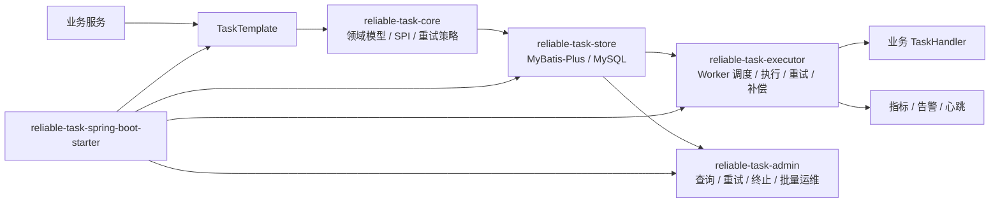

# ReliableTask

[English](README.md) | [中文](README.zh-CN.md)

ReliableTask 是一个基于 Spring Boot 3 的可靠异步任务执行框架，面向“业务事务提交后需要稳定执行异步动作”的场景。

它提供事务内任务投递、数据库任务存储、Worker 调度、自动重试、超时补偿、线程池隔离、管理 API 和 Spring Boot Starter 自动装配能力。

[](https://openjdk.org/projects/jdk/21/)
[](https://spring.io/projects/spring-boot)
[](https://baomidou.com/)
[](https://github.com/naruto863/reliable-task/actions/workflows/ci.yml)
[](LICENSE)

> 当前项目处于首次开源预览阶段，当前版本为 `v0.1.0`。生产使用前请完成数据库备份、Admin 鉴权、监控告警和容量评估。

## 目录

- [核心能力](#核心能力)
- [项目目录结构](#项目目录结构)
- [架构总览](#架构总览)
- [技术栈](#技术栈)
- [快速开始](#快速开始)
- [接入方式](#接入方式)
- [配置说明](#配置说明)
- [安全说明](#安全说明)
- [测试](#测试)
- [常见问题](#常见问题)
- [版本与发布](#版本与发布)
- [贡献](#贡献)
- [License](#license)

## 核心能力

| 能力 | 说明 |
| --- | --- |
| 事务内投递 | 在业务事务中写入任务，业务数据和任务记录同提交、同回滚 |
| 自动重试 | 支持固定间隔和指数退避策略，异常任务可按策略进入重试队列 |
| 补偿扫描 | 定时发现超时运行中的任务，降低 Worker 异常退出导致任务卡死的风险 |
| 线程池隔离 | 按任务类型配置线程池，避免单类热点任务拖垮所有异步执行 |
| 幂等支持 | 提供幂等策略 SPI 和默认策略，降低重复投递和重复执行风险 |
| 管理 API | 提供任务查询、重试、终止、重新入队、统计和 Worker 查询等接口 |
| Starter 接入 | 通过 Spring Boot 自动装配减少业务应用接入成本 |

## 项目目录结构

```text
reliable-task
├── reliable-task-core                 # 领域模型、SPI、枚举、异常、重试策略
├── reliable-task-store                # MyBatis-Plus 存储实现和 MySQL schema
├── reliable-task-executor             # Worker 调度、任务执行、重试、补偿、线程池
├── reliable-task-admin                # 管理 API、任务运维接口、指标收集
├── reliable-task-spring-boot-starter  # Spring Boot 自动装配和配置属性
├── reliable-task-demo                 # 可运行 Demo 工程
├── docs                               # 发布流程、开源检查报告等维护文档
└── .github                            # CI、Issue 模板、PR 模板
```

模块职责：

| 模块 | 职责 |
| --- | --- |
| `reliable-task-core` | 领域模型、SPI、枚举、异常、重试策略 |
| `reliable-task-store` | MyBatis-Plus 存储实现和 MySQL 表结构 |
| `reliable-task-executor` | 任务执行、Worker 调度、重试、补偿、线程池 |
| `reliable-task-admin` | 管理 API、任务运维接口、指标收集 |
| `reliable-task-spring-boot-starter` | 自动装配和配置属性 |
| `reliable-task-demo` | 可运行示例工程 |

## 架构总览

ReliableTask 的核心思路是把“业务事务提交后必须可靠执行的异步动作”先持久化为任务，再由 Worker 以可重试、可补偿、可观测的方式执行。它不依赖外部 MQ，当前预览版以 MySQL 作为任务状态和执行日志的事实来源。



执行链路：

1. 业务代码在事务中调用 `TaskTemplate` 投递任务。
2. `reliable-task-store` 将任务写入 MySQL，任务记录与业务事务保持一致。
3. Worker 按状态、下次执行时间、优先级拉取任务并抢占执行。
4. `TaskHandler` 执行业务动作；成功、失败、重试、死信状态都会回写任务表和日志表。
5. 补偿扫描会发现超时运行中的任务，降低 Worker 异常退出导致任务卡死的风险。
6. Admin API 用于任务查询、人工重试、终止、重新入队、统计和 Worker 状态查看。

## 技术栈

| 技术 | 版本 |
| --- | --- |
| Java | 21+ |
| Maven | 3.8+ |
| Spring Boot | 3.2.5 |
| MyBatis-Plus | 3.5.6 |
| MySQL | 8.0+ |
| JUnit | 5 |

## 快速开始

### 1. 克隆仓库

```bash
git clone https://github.com/naruto863/reliable-task.git
cd reliable-task
```

### 2. 初始化数据库

```sql
CREATE DATABASE reliable_task DEFAULT CHARACTER SET utf8mb4 COLLATE utf8mb4_unicode_ci;
```

```bash
mysql -u reliable_task_user -p reliable_task < reliable-task-store/src/main/resources/db/schema.sql
```

### 3. 准备 Demo 配置

`application.yml` 已被 `.gitignore` 忽略，请从示例文件生成本地配置并填入自己的数据库信息：

```bash
cp reliable-task-demo/src/main/resources/application-example.yml reliable-task-demo/src/main/resources/application.yml
```

推荐使用环境变量覆盖敏感配置：

```bash
export RELIABLE_TASK_DATASOURCE_URL="jdbc:mysql://localhost:3306/reliable_task?useUnicode=true&characterEncoding=utf-8&serverTimezone=Asia/Shanghai"
export RELIABLE_TASK_DATASOURCE_USERNAME="reliable_task_user"
export RELIABLE_TASK_DATASOURCE_PASSWORD="change_me"
```

### 4. 编译和测试

```bash
mvn -B test
```

### 5. 启动 Demo

```bash
mvn -pl reliable-task-demo -am spring-boot:run
```

### 6. 验证 Demo

```bash
curl -X POST "http://localhost:8080/demo/order?orderNo=ORD-001&buyerId=USER-123"
curl -H "X-Operator: admin" "http://localhost:8080/api/reliable-task/tasks"
curl -H "X-Operator: admin" "http://localhost:8080/api/reliable-task/tasks/stats"
```

## 接入方式

当前 `v0.1.0` 预览阶段默认通过源码构建后在本地或私有仓库引用，尚未发布到 Maven Central。

```xml
<dependency>
    <groupId>com.reliabletask</groupId>
    <artifactId>reliable-task-spring-boot-starter</artifactId>
    <version>0.1.0</version>
</dependency>
```

### 最小配置示例

```yaml
spring:
  datasource:
    url: ${RELIABLE_TASK_DATASOURCE_URL}
    username: ${RELIABLE_TASK_DATASOURCE_USERNAME}
    password: ${RELIABLE_TASK_DATASOURCE_PASSWORD}

reliable-task:
  enabled: true
  worker:
    enabled: true
  recovery:
    enabled: true
  admin:
    enabled: true
```

### 实现 TaskHandler

```java
@TaskHandler("SEND_EMAIL")
@TaskRetryable(maxRetryCount = 3, retryIntervalMs = 2000)
public class SendEmailHandler implements com.reliabletask.core.spi.TaskHandler {

    @Override
    public String getTaskType() {
        return "SEND_EMAIL";
    }

    @Override
    public void execute(TaskInstance task) throws Exception {
        // 在这里执行你的业务逻辑。
    }
}
```

### 在事务中投递任务

```java
@Service
@RequiredArgsConstructor
public class OrderService {

    private final TaskTemplate taskTemplate;

    @Transactional
    public void createOrder(String orderNo) {
        // 1. 保存业务数据。
        // 2. 在同一个事务内投递异步任务。
        taskTemplate.submit(TaskSubmitRequest.builder()
            .taskType("SEND_EMAIL")
            .bizType("ORDER")
            .bizId(orderNo)
            .payload("{\"to\":\"user@example.com\"}")
            .build());
    }
}
```

## 配置说明

常用配置前缀为 `reliable-task`：

| 配置项 | 默认值 | 说明 |
| --- | --- | --- |
| `reliable-task.enabled` | `true` | 框架总开关 |
| `reliable-task.worker.enabled` | `true` | Worker 拉取和执行开关 |
| `reliable-task.worker.poll-interval-ms` | `5000` | Worker 拉取间隔 |
| `reliable-task.worker.batch-size` | `10` | 单次拉取数量 |
| `reliable-task.recovery.enabled` | `true` | 超时补偿扫描开关 |
| `reliable-task.metrics.enabled` | `false` | Micrometer 指标开关 |
| `reliable-task.alert.enabled` | `false` | 告警扫描开关 |
| `reliable-task.admin.enabled` | `true` | 管理 API 开关 |
| `reliable-task.admin.auth.enabled` | `false` | Admin 权限 SPI 开关 |
| `reliable-task.admin.audit.enabled` | `false` | Admin 操作审计开关 |
| `reliable-task.admin.batch.enabled` | `false` | 批量运维 API 开关 |

完整示例见 [application-example.yml](reliable-task-demo/src/main/resources/application-example.yml)。

## 安全说明

- 不要提交 `application.yml`、`.env`、真实数据库账号、真实密码、Token、Cookie 或内部地址。
- Demo 的 `application-example.yml` 只包含占位符，真实配置应放在本地环境变量或私有配置中心。
- Admin API 默认适合本地演示。生产环境必须启用鉴权、审计、网络访问控制，并限制写操作权限。
- 如果发现漏洞或敏感信息泄露，请按 [SECURITY.md](SECURITY.md) 处理，不要直接公开披露。

## 测试

```bash
mvn -B test
```

当前测试以单元测试和不依赖外部 MySQL 的 H2 schema 校验为主。需要真实 MySQL 的 Demo 验证请按“快速开始”准备本地数据库。

## 常见问题

### ReliableTask 和 MQ 是什么关系？

ReliableTask 不是通用消息队列，也不替代 Kafka、RabbitMQ、RocketMQ 等 MQ。它更适合“业务事务提交后必须可靠执行一个业务动作”的场景，例如发货、发券、补偿同步、异步通知。当前实现用数据库保存任务状态，重点是事务一致性、重试、补偿和可运维性。

### 为什么不提交 `application.yml`？

`application.yml` 通常包含数据库账号、密码、内部地址或本地环境配置，不适合开源提交。仓库只保留 `.env.example` 和 `application-example.yml`，真实配置应放在本地环境变量、私有配置中心或被 `.gitignore` 忽略的本地配置文件中。

### Admin API 可以直接用于生产吗？

不建议直接暴露。Admin API 默认更适合本地 Demo 和受控内网验证。生产环境必须接入认证、授权、审计、网络访问控制和操作权限限制，尤其要保护重试、终止、重新入队、更新 payload 等写操作。

### 当前版本是否已经发布到 Maven Central？

还没有。`v0.1.0` 预览阶段默认通过源码构建、本地安装或私有 Maven 仓库引用。Maven Central 发布状态仍是 TODO。

### 运行测试是否需要本地 MySQL？

默认 `mvn -B test` 不要求本地 MySQL。当前测试以单元测试、Spring Boot 自动装配测试和 H2 schema 校验为主。只有运行 Demo 或做真实 MySQL 验证时才需要按快速开始初始化数据库。

### `0.x` 版本的兼容性如何承诺？

`0.x` 阶段属于首次开源预览期，API 和数据库 schema 仍可能调整。所有新增、修复、安全变更和破坏性变化都应记录在 [CHANGELOG.md](CHANGELOG.md)，发布前请优先阅读对应版本说明。

## 版本与发布

- 版本号遵循 SemVer。
- Git Tag 使用 `vX.Y.Z`，例如 `v0.1.0`。
- 变更记录维护在 [CHANGELOG.md](CHANGELOG.md)。
- 发布流程见 [docs/release-process.md](docs/release-process.md)。
- 开源前检查报告见 [docs/open-source-check-report.md](docs/open-source-check-report.md)。
- 首次开源发布使用 `v0.1.0` 预览版。

发布前示例命令：

```bash
mvn versions:set -DnewVersion=0.1.0
mvn -B test
git tag -a v0.1.0 -m "Release v0.1.0"
git push origin v0.1.0
```

## 贡献

欢迎通过 Issue 和 Pull Request 参与改进。提交前请阅读 [CONTRIBUTING.md](CONTRIBUTING.md)，并在 PR 中说明变更范围、测试结果、安全影响和兼容性影响。

## License

ReliableTask 使用 [Apache License 2.0](LICENSE) 发布。
