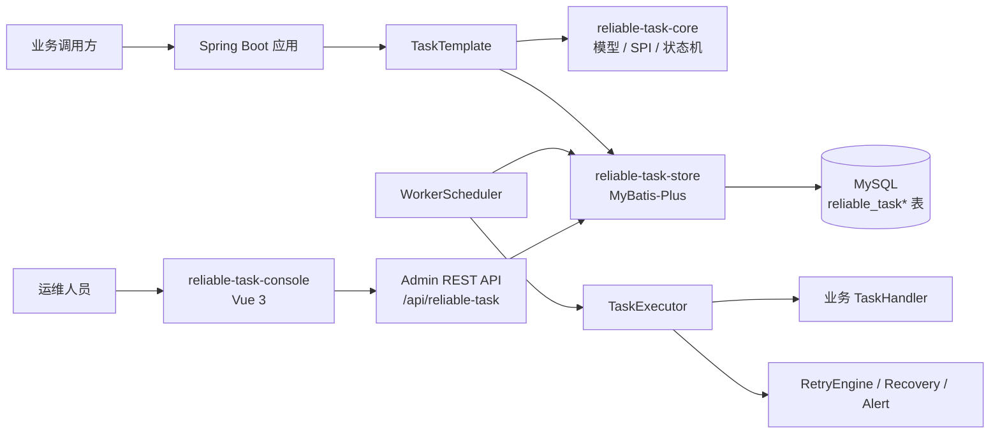

# ReliableTask 项目总览

ReliableTask 是一个面向 Spring Boot 应用的可靠异步任务执行框架。它把业务后续动作持久化到 MySQL，再由 Worker 拉取、抢占、执行、重试和恢复，适合“业务事务提交后必须可靠触发后续动作”的场景。

它不是通用消息队列，也不提供 exactly-once 外部副作用。它的核心价值是把本地数据库事务、任务状态、执行日志、运维查询和人工干预路径放在同一个可审计模型里。

## 项目能解决什么

典型场景包括：

- 订单创建后创建发货任务；
- 支付成功后发放权益或发送通知；
- 业务数据变更后同步外部系统；
- 外部服务失败时需要可追踪的重试、死信和人工处理入口。

不适合的场景包括：

- 需要 Kafka/RabbitMQ/RocketMQ 这类跨系统高吞吐 pub/sub；
- 需要工作流编排、人工审批、长事务 Saga 状态机；
- 不能使用 MySQL 或不能新增 ReliableTask 表；
- 外部副作用不能做业务幂等。

## 真实组件

下图只包含本仓库代码和配置中真实存在的组件。

## 模块一览

| 模块 | 定位 | 主要代码入口 |
| --- | --- | --- |
| `reliable-task-core` | 核心模型、状态、SPI、DTO/VO | `src/main/java/com/reliabletask/core` |
| `reliable-task-store` | MyBatis-Plus 存储实现和 MySQL schema | `MyBatisTaskStore.java`, `src/main/resources/db` |
| `reliable-task-executor` | 投递模板、Worker、执行、重试、恢复 | `TransactionAwareTaskTemplate.java`, `TaskExecutor.java`, `WorkerScheduler.java` |
| `reliable-task-admin` | Admin REST API、查询保护、指标聚合 | `TaskAdminController.java`, `AdminQueryGuard.java` |
| `reliable-task-spring-boot-starter` | worker-only 自动配置 | `ReliableTaskExecutorAutoConfiguration.java` |
| `reliable-task-admin-spring-boot-starter` | Admin API 显式 opt-in 自动配置 | `ReliableTaskAdminAutoConfiguration.java` |
| `reliable-task-demo` | 可运行 demo | `DemoController.java`, `OrderService.java` |
| `reliable-task-console` | 独立 Vite/Vue 运维控制台预览 | `src/api/client.ts`, `src/stores`, `src/views` |

## 10 分钟阅读路径

1. 先读本文，理解项目边界。
2. 读 [01-architecture.md](01-architecture.md)，看运行时结构。
3. 读 [03-core-flows.md](03-core-flows.md)，看投递、执行、重试、恢复和 Admin 写保护。
4. 读 [04-domain-model.md](04-domain-model.md)，看核心表和状态模型。
5. 读 [08-local-development.md](08-local-development.md)，本地跑起来。

## 已确认不存在的组件

本轮扫描未发现 Dockerfile、docker-compose、K8s 配置、Redis、MQ、对象存储、AI 服务、Android 工程或独立管理端口实现。后续文档不会把这些组件画入架构图。

