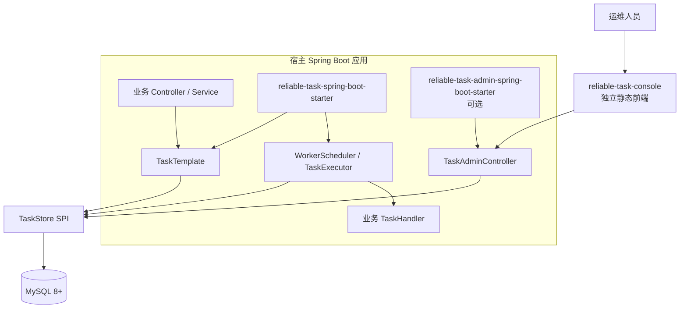
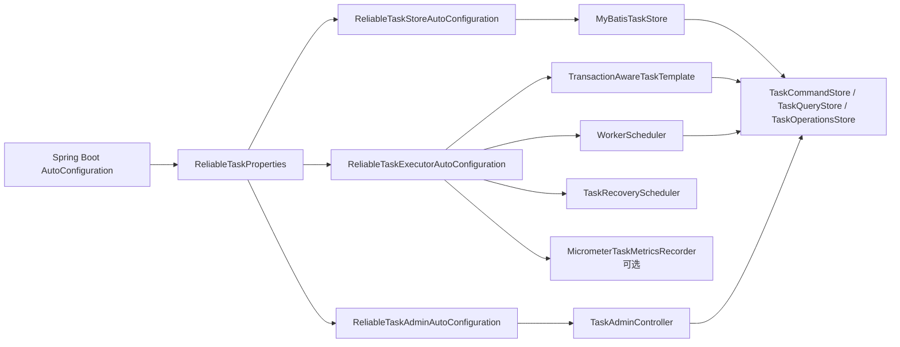

# 架构说明

ReliableTask 的架构围绕一个核心问题展开：业务数据提交后，后续动作必须可持久化、可重试、可恢复、可查询。项目选择 MySQL-backed Outbox 模型，而不是把任务先交给内存线程池或外部 MQ。

## 容器视图

`reliable-task-spring-boot-starter` 是 worker-only starter。应用只有显式加入 `reliable-task-admin-spring-boot-starter` 且设置 `reliable-task.admin.enabled=true`，才会暴露 Admin REST API。

## 运行时分层

| 层 | 主要职责 | 代码入口 |
| --- | --- | --- |
| Core | 领域模型、状态机、SPI、DTO/VO、异常、重试策略接口 | `reliable-task-core/src/main/java/com/reliabletask/core` |
| Store | MySQL 表、MyBatis entity/mapper、`TaskStore` 实现 | `reliable-task-store/src/main/java/com/reliabletask/store` |
| Executor | 任务投递、Worker 定时扫描、执行器、重试、恢复、告警 | `reliable-task-executor/src/main/java/com/reliabletask/executor` |
| Admin | REST API、查询窗口限制、写保护、审计入口 | `reliable-task-admin/src/main/java/com/reliabletask/admin` |
| Starter | Spring Boot 自动装配与配置绑定 | `reliable-task-spring-boot-starter`, `reliable-task-admin-spring-boot-starter` |
| Console | Vue 运维界面、API client、Pinia store、页面 | `reliable-task-console/src` |

## 自动配置关系

配置入口是 `reliable-task` 前缀，对应 `ReliableTaskProperties.java`。`serializer.type`、`store.table-prefix`、`admin.port`、`admin.context-path` 当前是兼容保留配置，不改变运行行为。

## 关键架构边界

- Worker 执行和 Admin API 不强绑定。worker-only 应用不应该默认暴露 Web/Admin 依赖。
- Console 是独立前端，不打包进 Java starter，也不是任务执行必需组件。
- MySQL 是当前唯一真实存储实现。测试里有 H2 schema 校验和 Testcontainers/local MySQL profile，但生产路径仍以 MySQL 8+ 为目标。
- Admin 写操作需要同时满足 write 开关、auth、audit、确认头和后端状态机约束，不能只依赖前端隐藏按钮。

## 代码阅读入口

建议按以下顺序阅读：

1. `TaskSubmitRequest.java`, `TaskInstance.java`, `TaskStatus.java`
2. `TransactionAwareTaskTemplate.java`
3. `MyBatisTaskStore.java`
4. `WorkerScheduler.java`, `TaskExecutor.java`, `RetryEngine.java`
5. `TaskRecoveryScheduler.java`
6. `TaskAdminController.java`
7. `reliable-task-console/src/api/client.ts`

