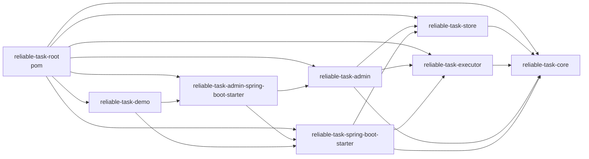
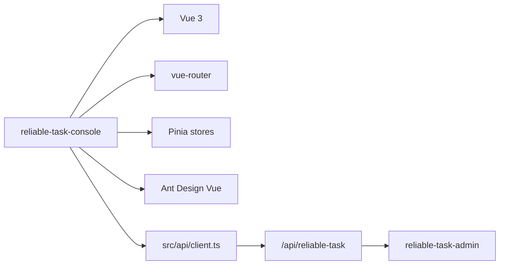

# 模块依赖图

本项目的 Java 部分是 Maven reactor；Console 是独立 Vite 前端，不参与 Maven reactor。理解模块依赖能避免把 Admin、Console 或 demo 能力误认为核心执行链必需能力。

## Maven 模块依赖

`reliable-task-executor` 对 `reliable-task-store` 的依赖只出现在测试作用域，运行时通过 `TaskCommandStore` 等 SPI 对接存储能力。

## Console 独立依赖

Console 的本地开发通过 Vite dev server 代理 `/api/reliable-task` 到 demo 后端，默认目标在 `reliable-task-console/.env.example` 中是 `http://localhost:8080`。

## 包级职责

| 包或目录 | 职责 |
| --- | --- |
| `core/model` | `TaskInstance`、`TaskSubmitRequest`、执行租约、事件、审计等领域对象 |
| `core/spi` | Store、Handler、Retry、Codec、Auth、Audit、Event、Metrics 等扩展接口 |
| `core/lifecycle` | `TaskStateMachine` 状态流转约束 |
| `core/strategy` | 内置幂等和重试策略 |
| `store/entity` | MyBatis-Plus entity，与 MySQL 表字段对应 |
| `store/mapper` | MyBatis mapper |
| `store/impl` | `MyBatisTaskStore`，统一实现命令、查询和运维存储能力 |
| `executor/template` | 事务感知投递模板 |
| `executor/worker` | Worker 定时拉取、抢占和心跳 |
| `executor/handler` | Handler 注册、执行、超时、并发限制 |
| `executor/retry` | 失败分类、重试或 DEAD 决策 |
| `executor/recovery` | 超时 RUNNING 任务恢复 |
| `admin/controller` | REST API、写保护、审计、查询 guard |
| `starter/autoconfigure` | Spring Boot 自动配置 |
| `reliable-task-console/src/stores` | 前端状态管理和 API 编排 |
| `reliable-task-console/src/views` | Dashboard、Tasks、Detail、Workers、Audit 页面 |

## 测试分布

| 测试层 | 入口 |
| --- | --- |
| Core 单元测试 | `reliable-task-core/src/test/java` |
| Store H2/schema/mapper 测试 | `reliable-task-store/src/test/java` |
| MySQL 集成测试 | `reliable-task-store/src/test/java/com/reliabletask/store/mysql`, `reliable-task-executor/src/test/java/com/reliabletask/executor/mysql` |
| Executor 单元/集成测试 | `reliable-task-executor/src/test/java` |
| Admin Controller 测试 | `reliable-task-admin/src/test/java` |
| Starter 自动配置测试 | `reliable-task-spring-boot-starter/src/test/java`, `reliable-task-admin-spring-boot-starter/src/test/java` |
| Console 单元测试 | `reliable-task-console/src/**/*.spec.ts` 和 `*.spec.ts` |
| Console smoke | `reliable-task-console/tests/smoke` |

