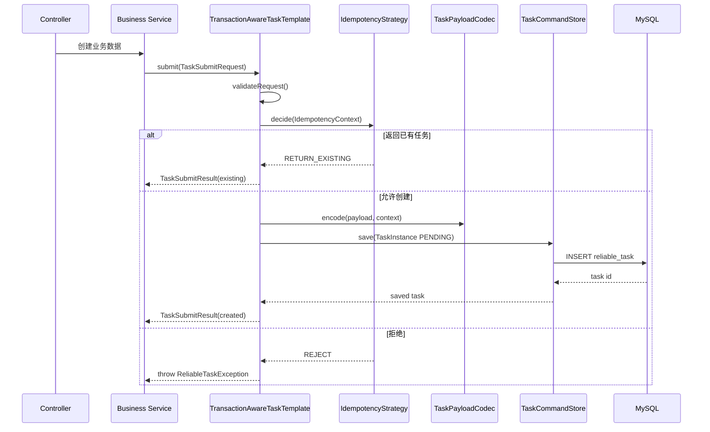
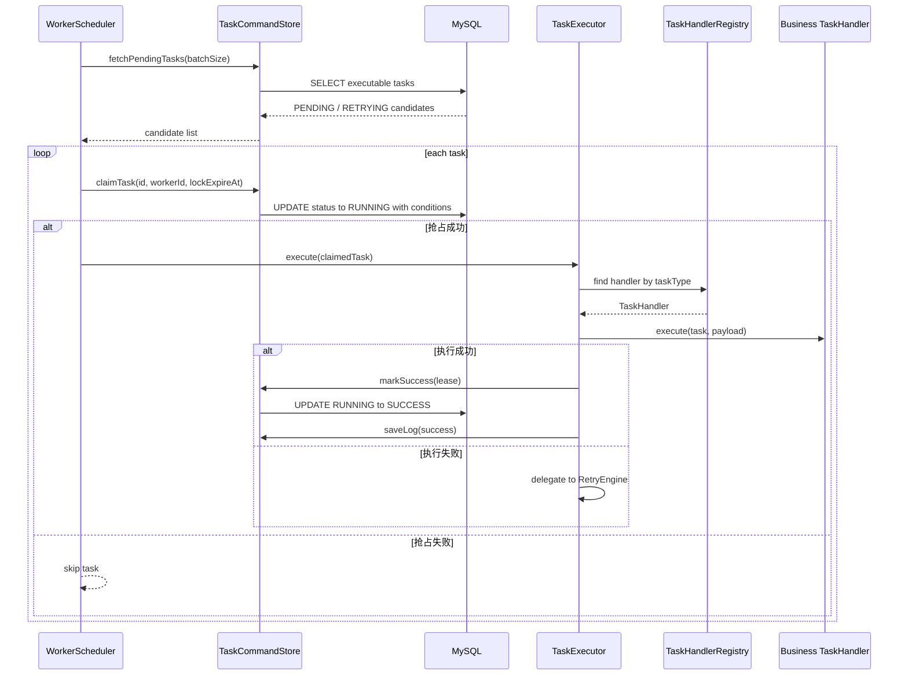
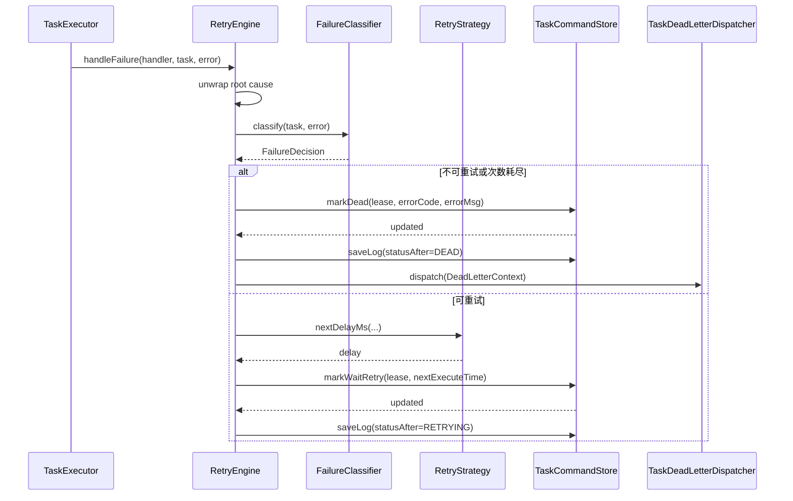
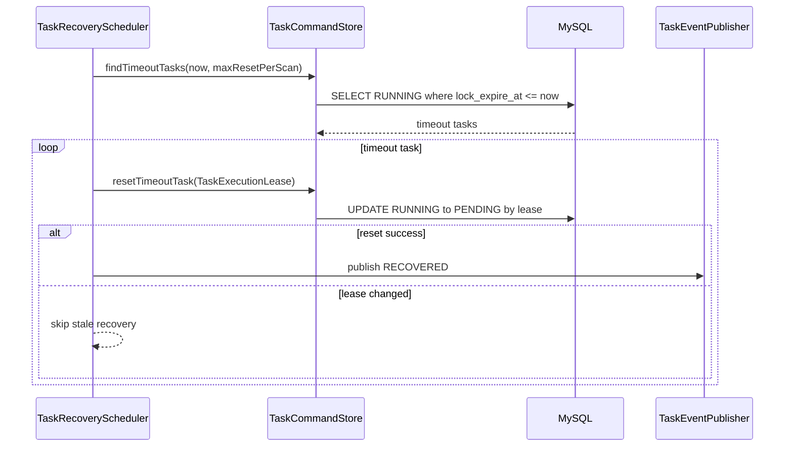
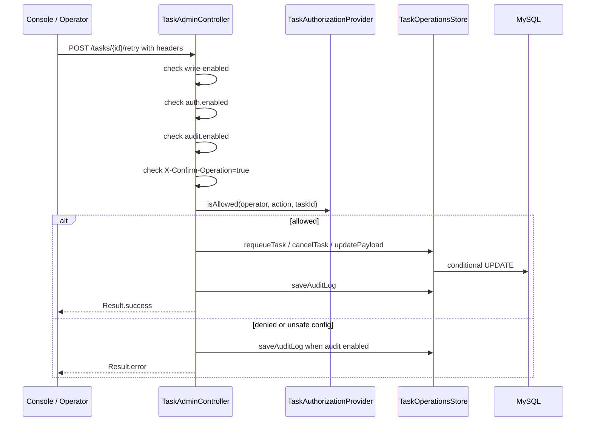

# 核心流程

ReliableTask 的关键流程可以分为投递、执行、失败重试、超时恢复和 Admin 运维操作。每个流程都以 MySQL 状态为最终事实源。

## 事务投递流程

代码入口：

- `reliable-task-demo/src/main/java/com/reliabletask/demo/service/OrderService.java`
- `reliable-task-executor/src/main/java/com/reliabletask/executor/template/TransactionAwareTaskTemplate.java`
- `reliable-task-store/src/main/java/com/reliabletask/store/impl/MyBatisTaskStore.java`

投递发生在业务事务内。业务事务回滚时，任务记录也随之回滚。幂等键最终由 `reliable_task.uk_biz_unique_key` 兜底裁决。

## Worker 执行流程

`fetchPendingTasks` 只是候选快照；真正的并发归属由 `claimTask` 的条件更新决定。执行成功回写优先使用 `TaskExecutionLease`，避免旧 worker 污染新租约状态。

## 失败、重试和死信流程

代码入口：

- `RetryEngine.java`
- `DefaultFailureClassifier.java`
- `TaskDeadLetterDispatcher.java`
- `TaskStateMachine.java`

`NonRetryableException` 默认进入 DEAD；其他异常默认进入重试判断。自定义 `FailureClassifier` 可以提前判定 DEAD 或继续重试。

## 超时恢复流程

恢复扫描不证明旧业务调用已经停止。`Future.cancel(true)` 只是请求中断，业务 handler 和外部系统仍必须具备幂等保护。

## Admin 写保护流程

Admin 写入口包括单任务 retry/cancel/requeue/payload update，以及批量 preview/requeue/cancel。前端会根据 `ConsoleCapabilitiesVO` 禁用按钮，但最终保护在后端。

