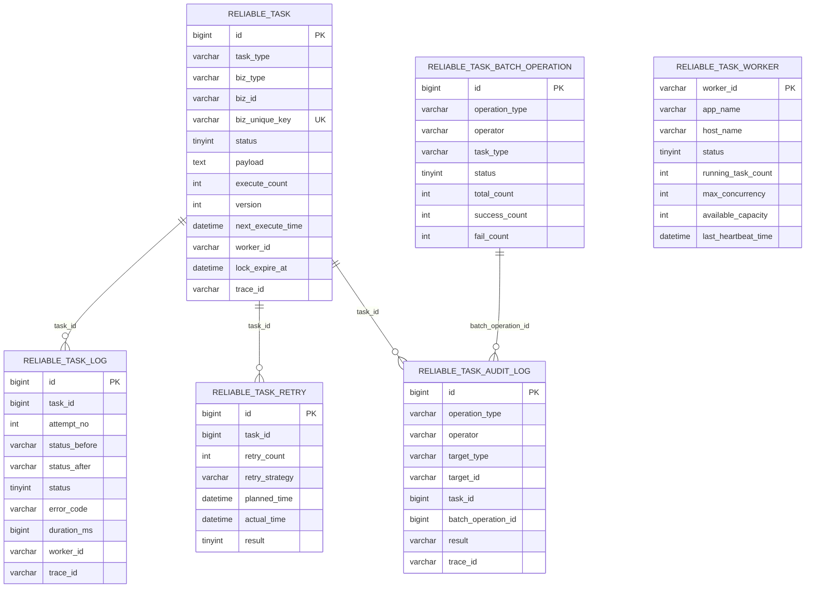
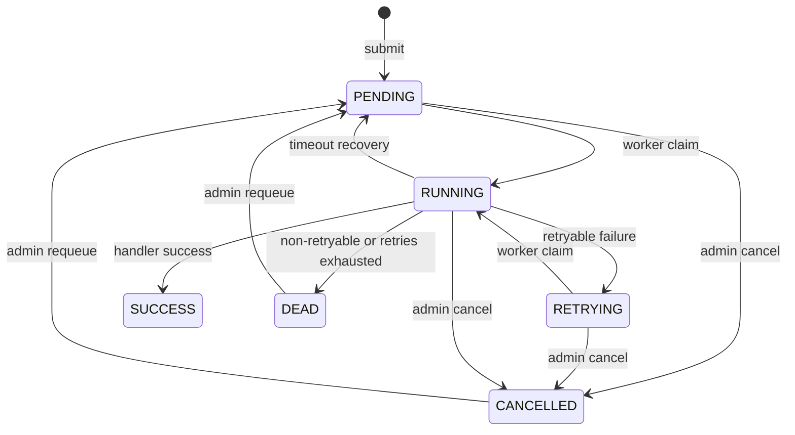

# 领域模型与数据模型

ReliableTask 的领域模型围绕任务实例展开：任务从 PENDING 开始，由 Worker 抢占为 RUNNING，最终进入 SUCCESS、RETRYING、DEAD 或 CANCELLED。MySQL 表保存任务事实、执行日志、Worker 心跳、审计和批量操作记录。

## 核心表关系

当前 schema 没有声明显式外键，下面展示的是基于字段的逻辑关系。

表定义入口：

- `reliable-task-store/src/main/resources/db/schema.sql`
- `reliable-task-store/src/main/resources/db/migration/V1__init_reliable_task_schema.sql`
- `reliable-task-store/src/main/resources/db/changelog/db.changelog-master.yaml`

同一个数据库只能选择一种初始化路径，不能把 plain SQL、Flyway、Liquibase 混用。

## 任务状态模型

`FAILED` 是兼容状态码和执行日志失败结果，不是当前主生命周期主动流转目标。状态定义在 `TaskStatus.java`，合法流转集中在 `TaskStateMachine.java`。

## 关键字段说明

| 字段 | 所属表 | 含义 |
| --- | --- | --- |
| `biz_unique_key` | `reliable_task` | 投递幂等键，有唯一索引 `uk_biz_unique_key` |
| `status` | `reliable_task` | 任务生命周期状态，数据库保存 tinyint |
| `version` | `reliable_task` | 乐观锁版本，用于并发状态更新 |
| `worker_id` | `reliable_task`, `reliable_task_log` | 当前或历史执行节点 |
| `lock_expire_at` | `reliable_task` | RUNNING 租约过期时间，恢复扫描依据 |
| `trace_id` | 多表 | 链路追踪和审计关联 |
| `tenant_id` | `reliable_task` | 可选租户隔离字段 |
| `request_summary` | `reliable_task_audit_log` | 操作摘要，避免保存完整敏感 payload |

## 领域对象与表映射

| 领域对象 | 存储对象 | 说明 |
| --- | --- | --- |
| `TaskInstance` | `ReliableTaskEntity` | 任务主表领域模型 |
| `TaskLogVO` | `ReliableTaskLogEntity` | 执行日志查询视图 |
| `WorkerHeartbeat` | `ReliableTaskWorkerEntity` | Worker 心跳和容量 |
| `AuditLog` | `ReliableTaskAuditLogEntity` | Admin 操作审计 |
| `BatchOperationResult` | `ReliableTaskBatchOperationEntity` | 批量操作预览和执行结果 |

转换入口是 `ReliableTaskConverter.java`。

