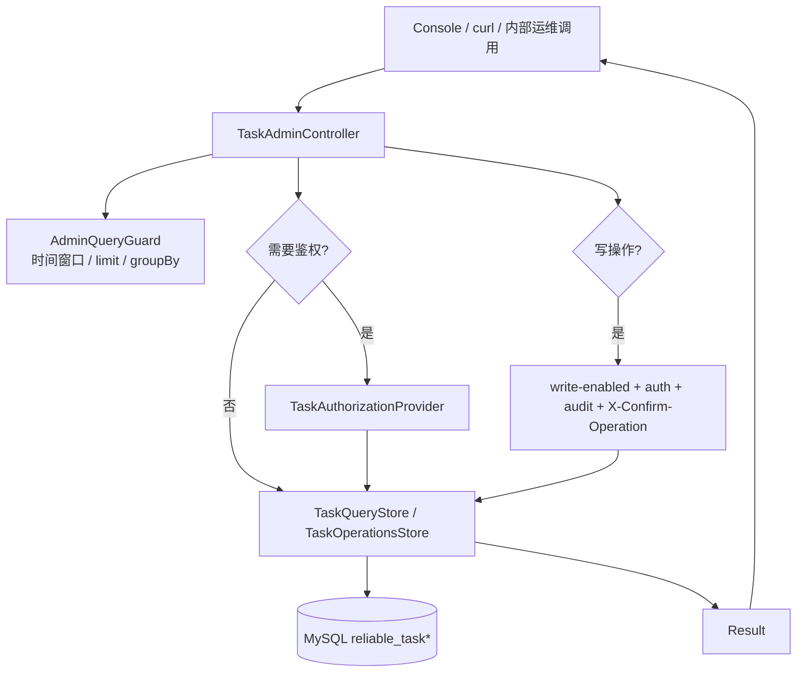
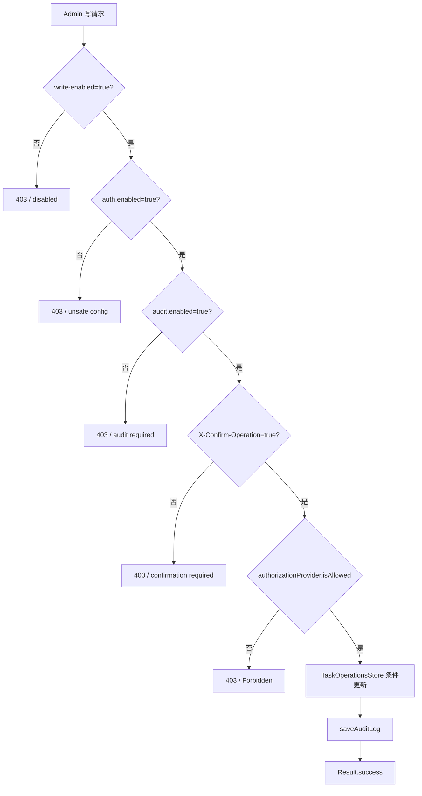

# API 设计

ReliableTask 的 REST API 由 `reliable-task-admin` 提供，基础路径固定为 `/api/reliable-task`。这些接口是内部运维面，不是公开互联网 API。

## 请求处理路径

本轮扫描未发现独立 `GlobalExceptionHandler`。当前 Admin API 主要由 Controller 返回 `Result<T>`，并在写保护、权限拒绝、功能关闭等分支中显式返回错误结果。

## 主要接口

| 方法 | 路径 | 作用 |
| --- | --- | --- |
| `GET` | `/tasks` | 分页查询任务 |
| `GET` | `/tasks/{id}` | 查询任务详情 |
| `GET` | `/tasks/{id}/logs` | 查询执行日志 |
| `GET` | `/tasks/{id}/timeline` | 查询生命周期时间线 |
| `GET` | `/tasks/stats` | Dashboard 统计 |
| `GET` | `/tasks/recent-failures` | 最近失败任务 |
| `GET` | `/tasks/slow` | 慢任务 |
| `GET` | `/tasks/failure-top` | 失败聚合 |
| `GET` | `/workers` | Worker 心跳与容量 |
| `GET` | `/workers/stale` | 失联 Worker |
| `GET` | `/console/capabilities` | Console 能力开关 |
| `GET` | `/console/tasks/{id}` | Console-safe 任务详情 |
| `POST` | `/tasks/{id}/retry` | 人工 retry |
| `POST` | `/tasks/{id}/cancel` | 人工 cancel |
| `POST` | `/tasks/{id}/requeue` | 人工 requeue |
| `PUT` | `/tasks/{id}/payload` | 更新 payload |
| `GET` | `/tasks/{id}/audit-logs` | 指定任务审计日志 |
| `GET` | `/audit-logs` | 审计日志分页查询 |
| `POST` | `/tasks/batch/preview` | 批量操作预览 |
| `POST` | `/tasks/batch/requeue` | 批量重新入队 |
| `POST` | `/tasks/batch/cancel` | 批量取消 |

## Console-safe contract

Console 不直接读取裸 `TaskDetailVO` 的全部 payload。后端提供：

- `ConsoleCapabilitiesVO`：告知 `writeEnabled`、`authEnabled`、`auditEnabled`、`batchEnabled`、payload 明文策略、分页和批量上限；
- `ConsoleTaskDetailVO`：控制台安全详情；
- `PayloadViewVO`：payload 预览、是否可 reveal、是否包含明文。

前端入口：

- `reliable-task-console/src/api/client.ts`
- `reliable-task-console/src/api/types.ts`
- `reliable-task-console/src/stores/consoleStore.ts`
- `reliable-task-console/src/views/TaskDetailView.vue`

## 写操作安全条件

前端会附加 `X-Confirm-Operation: true`，并要求批量操作先 preview 再 execute。但这些只是用户体验和误触保护，最终状态更新仍由后端和数据库条件更新裁决。

## 查询保护

`AdminQueryGuard` 负责把运维查询限制在可控范围内，例如默认时间窗口、最大窗口、默认 limit、最大 limit 和 slow threshold。相关配置在 `reliable-task.admin.query.*`。

