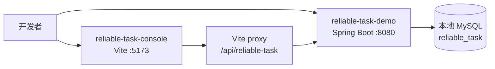
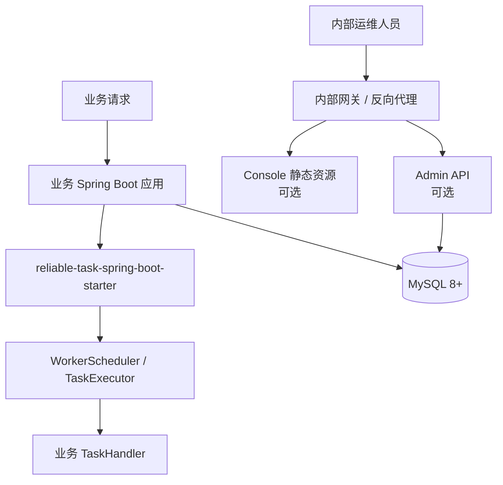
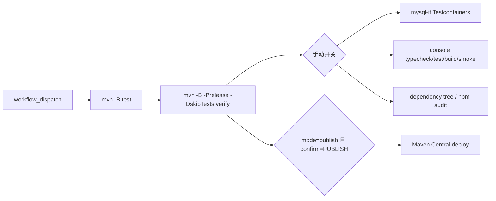

# 部署说明

当前仓库没有 Dockerfile、docker-compose、K8s、Nacos 或独立管理端口配置。部署方式应按真实代码理解为：宿主 Spring Boot 应用引入 starter，连接 MySQL；如需要 Admin API 和 Console，则显式开启并放在内部运维访问边界后面。

## 本地 demo 拓扑



本地 demo 配置入口：

- `reliable-task-demo/src/main/resources/application-example.yml`
- `.env.example`
- `reliable-task-console/.env.example`

demo 为本地探索显式开启 Admin API。生产环境不要直接复用 demo 的 Admin 配置。

## 生产接入拓扑



生产建议：

- worker-only 应用只引入 `reliable-task-spring-boot-starter`；
- 需要 Admin API 的应用再引入 `reliable-task-admin-spring-boot-starter`；
- Admin API 保持内部网络访问，启用认证、授权、审计和确认头；
- Console 静态资源独立部署，不打进 Java starter；
- payload、错误信息、审计摘要不要保存凭据、Token、私钥或原始敏感个人信息。

## 配置项

最小运行需要宿主应用提供 datasource：

```yaml
spring:
  datasource:
    url: ${RELIABLE_TASK_DATASOURCE_URL}
    username: ${RELIABLE_TASK_DATASOURCE_USERNAME}
    password: ${RELIABLE_TASK_DATASOURCE_PASSWORD}
```

ReliableTask 配置使用 `reliable-task` 前缀，核心分组包括：

- `worker`：轮询、批量、锁 TTL、心跳和背压；
- `recovery`：超时恢复扫描；
- `retry`：指数退避、jitter、min/max delay；
- `executor`：线程池或 virtual thread 模式；
- `metrics`：Micrometer 指标；
- `alert`：积压和失败告警扫描；
- `admin`：Admin API、写保护、查询 guard、审计、批量、Console payload 策略。

## 发布工作流



`release.yml` 默认是 dry-run。真实发布需要 Central/GPG secrets，并显式输入 `PUBLISH`。不要把 Central token、GPG 私钥或 passphrase 写入仓库文档。

