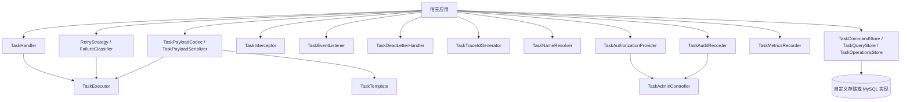

# 扩展点说明

ReliableTask 的扩展点主要集中在 `reliable-task-core/src/main/java/com/reliabletask/core/spi`。二次开发时应优先扩展 SPI，而不是修改执行器或存储内部逻辑。

## 扩展点地图

## 常用扩展点

| 扩展点 | 什么时候用 | 默认或现有实现 |
| --- | --- | --- |
| `TaskHandler` | 定义具体业务任务处理逻辑 | demo 的 `CreateShipmentHandler` |
| `@TaskRetryable` | 为 handler 指定重试次数、间隔、超时 | 注解定义在 `core/annotation` |
| `RetryStrategy` | 增加自定义重试策略 | `FixedRetryStrategy`, `ExponentialRetryStrategy` |
| `FailureClassifier` | 根据异常或业务上下文决定 RETRY/DEAD | `DefaultFailureClassifier` |
| `IdempotencyStrategy` | 控制重复投递行为 | `StrictUniqueIdempotencyStrategy`, `AllowAfterTerminalIdempotencyStrategy` |
| `TaskPayloadCodec` | 基于任务上下文做 payload 编解码 | 默认适配 `TaskPayloadSerializer` |
| `TaskInterceptor` | 执行前后、异常时注入横切逻辑 | `TraceTaskInterceptor` |
| `TaskEventListener` | 观察任务状态事件 | Micrometer listener 可选注册 |
| `TaskDeadLetterHandler` | DEAD 后通知、归档或补偿 | no-op 默认 |
| `TaskTraceIdGenerator` | 定制 traceId 生成策略 | `DefaultTaskTraceIdGenerator` |
| `TaskNameResolver` | 定制 handler 名称解析 | `DefaultTaskNameResolver` |
| `TaskAuthorizationProvider` | Admin 权限判断 | `NoopTaskAuthorizationProvider` 仅在 auth disabled 场景使用 |
| `TaskAuditRecorder` | 记录执行或运维审计 | no-op 默认，Admin 写操作依赖 Store 审计 |
| `TaskMetricsRecorder` | 记录执行指标 | `MicrometerTaskMetricsRecorder` |
| `TaskCommandStore` | 投递、抢占、状态更新 | `MyBatisTaskStore` |
| `TaskQueryStore` | Admin 查询、统计、运维视图 | `MyBatisTaskStore` |
| `TaskOperationsStore` | Admin 写、worker 心跳、审计、批量操作 | `MyBatisTaskStore` |

## 推荐扩展顺序

1. 新增任务类型时，只实现 `TaskHandler` 并配置 `@TaskRetryable`。
2. 需要区分业务不可重试错误时，增加 `FailureClassifier` 或抛出 `NonRetryableException`。
3. 需要特殊 payload 处理时，优先提供 `TaskPayloadCodec` Bean。
4. 需要观测链路时，增加 `TaskEventListener`、`TaskMetricsRecorder` 或 `TaskInterceptor`。
5. 需要开放 Admin 写操作时，先接入真实认证、授权和审计，再启用 `write-enabled`。
6. 只有在替换存储后端时，才实现 Store SPI；优先依赖最窄接口。

## 不建议的扩展方式

- 不要跳过状态机直接更新数据库状态。
- 不要让前端按钮可见性成为唯一安全控制。
- 不要在 payload、idempotency key、error message 或 audit summary 中写入密钥、Token 或原始敏感个人信息。
- 不要在 v1.0 线删除兼容保留 API，例如 deprecated `TaskSerializer` 或 `TaskStore` facade。

