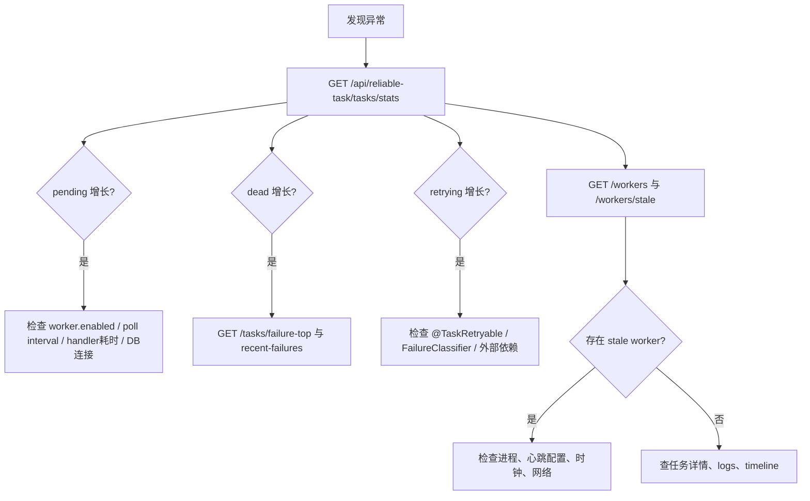

# 常见问题排查

排查 ReliableTask 问题时，先用 Admin API、指标和日志确认现象，再决定是否需要查数据库。不要直接通过 SQL 手工改状态，除非已有明确恢复方案和备份。

## 快速分流

## 任务积压

现象：

- `pendingTasks` 持续增长；
- oldest pending age 上升；
- Worker 容量不足或没有 Worker 心跳。

优先检查：

- `reliable-task.worker.enabled` 是否为 true；
- `worker.batch-size`、线程池、handler `maxConcurrency()` 是否过小；
- handler 是否被外部 HTTP/RPC 调用阻塞；
- MySQL 连接池和 `idx_status_next_priority_id` 是否可用；
- Console Workers 页面或 `GET /workers` 是否能看到容量。

## DEAD 增长

现象：

- `deadTasks` 上升；
- `failure-top` 聚合到某些 taskType 或 errorCode。

优先检查：

- `GET /tasks/recent-failures`；
- `GET /tasks/{id}/logs`；
- `GET /tasks/{id}/timeline`；
- handler 是否抛出 `NonRetryableException`；
- `FailureClassifier` 是否把某类异常判为 DEAD；
- 外部服务是否返回业务终态错误。

处理建议：

- 先确认外部副作用是否已经发生；
- 必须保证业务幂等后再 requeue；
- Admin 写操作需要 auth、audit、write-enabled 和 `X-Confirm-Operation`。

## 重试风暴

现象：

- RETRYING 快速增加；
- 同一 errorCode 高频出现；
- 外部依赖告警。

优先检查：

- `@TaskRetryable` 的 `maxRetryCount`、`retryIntervalMs`、`maxDelayMs`；
- `reliable-task.retry.jitter-ratio` 是否开启；
- `FailureClassifier` 是否应将某些业务错误判 DEAD；
- 外部调用 timeout 是否合理；
- handler 是否缺少本地幂等表或外部 idempotency key。

## 超时恢复增加

现象：

- RUNNING 被恢复为 PENDING；
- 同一任务可能重复执行。

优先检查：

- handler `timeoutMs()` 与真实耗时是否匹配；
- `worker.lock-ttl-seconds` 是否小于长任务执行时间；
- 心跳续约是否开启且正常；
- 外部调用是否忽略线程中断。

注意：恢复只说明租约过期，不说明旧外部副作用没有发生。

## Console 无法访问后端

检查：

- `VITE_RELIABLE_TASK_API_BASE` 是否仍是 `/api/reliable-task`；
- Vite proxy `VITE_RELIABLE_TASK_PROXY_TARGET` 是否指向 demo 后端；
- 后端是否引入 admin starter 并设置 `reliable-task.admin.enabled=true`；
- 浏览器网络面板是否出现 404、403 或代理错误。

如果写按钮不可用，优先看 `/console/capabilities` 返回的 `writeEnabled`、`authEnabled`、`auditEnabled`、`batchEnabled`。

## 验证被环境阻塞

常见阻塞：

- Docker/Testcontainers 不可用；
- 本地 MySQL 不可达；
- 本地 MySQL 库不是专用可清理测试库；
- npm registry 或网络不可用；
- GitHub workflow scope 或 secrets 缺失。

记录方式应区分：

- `PASS`：真实执行并通过；
- `FAIL_CODE`：执行了但代码或测试失败；
- `BLOCKED_ENV`：环境阻塞，无法验证；
- `NOT_RUN`：尚未执行。

